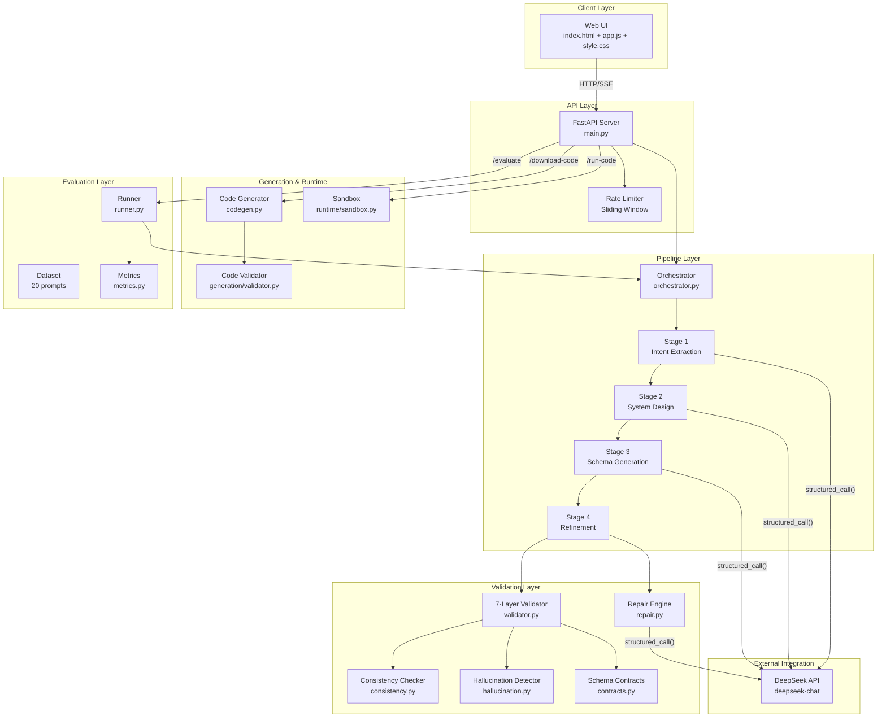

# App Compiler

A multi-stage pipeline designed to transform natural language application specifications into validated, executable software configurations. Built as a compiler-inspired architecture with strict schema enforcement, cross-layer validation, and targeted algorithmic repair, ensuring structural integrity prior to code generation.

---

## Operational Architecture

The system processes input through four sequential stages, each bound by a rigorous JSON Schema contract. Output from every stage is strictly validated before subsequent operations commence. If the final compilation fails validation, an intelligent repair engine applies surgical corrections rather than defaulting to complete regeneration.

```
User Specification ("Build a CRM with login, contacts, dashboard...")
    |
    v
Stage 1: Intent Extraction  -->  Intent IR
    |                             (entities, features, roles, constraints)
    |                             (ambiguity flags, clarification questions)
    v
Stage 2: System Design       -->  Architecture IR
    |                             (entity schemas, pages, API endpoints)
    |                             (auth rules, business logic, relations)
    v
Stage 3: Schema Generation   -->  Complete Config
    |                             (UI, API, DB, Auth, Business Logic)
    |                             (Parallelized via ThreadPoolExecutor)
    v
Stage 4: Refinement          -->  Validated Config
    |                             (7-layer sequential validation)
    |                             (Targeted repair engine, up to 3 passes)
    v
Code Generator               -->  schema.sql, app.py, models.py, schemas.py, 
                                  auth.py, business.py, templates/, Dockerfile
```

Each transition represents a strict data contract. Operations will not proceed unless structural schemas are perfectly aligned.

---

## System Architecture



---

## Pipeline Stages

### Stage 1: Intent Extraction
Parses unstructured natural language into a formalized Intent Intermediate Representation (IR). Identifies ambiguities (`is_vague`), structural conflicts (`has_conflicts`), and data deficiencies (`is_incomplete`). Formulates clarification inquiries for blocking issues or documents operational assumptions for non-blocking execution.

**Input:** Natural language text
**Output:** Intent IR — structured JSON detailing entities, features, roles, constraints, and ambiguity analysis.

### Stage 2: System Design
Translates the Intent IR into a comprehensive Architecture IR. Defines every operational entity with explicitly typed fields and referential relationships, interfaces with component bindings, API endpoints with cryptographic auth requirements, role parameters with granular access control, and business rules mapped to execution conditions.

**Input:** Intent IR
**Output:** Architecture IR — entities, pages, API endpoints, auth parameters, business rules.

### Stage 3: Schema Generation
Constructs five definitive schemas derived from the Architecture IR. The database schema is compiled initially, providing the foundational context for the API schema to ensure complete consistency. The UI, Authentication, and Business Logic schemas are subsequently processed in parallel through a ThreadPool architecture to optimize computational latency.

**Input:** Architecture IR
**Output:** Unified configuration encompassing `ui_schema`, `api_schema`, `db_schema`, `auth_schema`, and `business_logic`.

### Stage 4: Refinement
Executes a 7-layer validation protocol across the unified configuration. Identifies discrepancies and dispatches them to a 17-strategy targeted repair engine. Deduplication logic ensures each unique error signature is attempted only once. Repairs are strictly surgical (e.g., appending a missing SQL column, decoupling a broken foreign key, coercing a data type) to preserve valid computations.

**Input:** Unified configuration + Architecture IR
**Output:** Validated configuration containing a deduplicated repair log and final validation status.

---

## Validation Engine

Seven sequential compliance layers, each isolating a specific classification of architectural variance:

| Layer | Evaluation Scope | Variance Example |
|-------|------------------|------------------|
| 1. JSON Validity | Ensures output is a parsable, serializable object. | `json.dumps()` encounters a TypeError. |
| 2. Required Fields | Verifies all mandatory schema blocks are instantiated. | `metadata.app_name` block is missing. |
| 3. Type Safety | Validates SQL column dialect compatibility and HTTP protocol methods. | Column `age` designated as type `REVENUE_TYPE`. |
| 4. Reference Integrity | Confirms all foreign keys, endpoint bindings, and entity markers resolve. | Foreign key references `departments` but no table exists. |
| 5. Cross-Layer Consistency | Ensures UI data bindings map to API routes, API routes return validated DB columns, and endpoints require verified roles. | API response exposes `priority` parameter not present in DB. |
| 6. Logical Consistency | Identifies circular dependencies, validates access matrix distribution. | Cycle detected: `users -> profiles -> users`. |
| 7. Hallucination Detection | Audits system against original Architecture IR for unauthorized data injection. | Table `ghost_products` generated without architectural mandate. |

---

## Targeted Repair Engine

17 specialized execution strategies mapped precisely to unique `error_type` parameters. Deterministic heuristic repairs operate instantaneously (removing invalid constraints, coercing types). LLM-assisted repairs are deployed exclusively for missing structural synthesis (generating absent relational tables or endpoint configurations).

| Operation Strategy | Discrepancy Trigger | Resolution Method |
|--------------------|---------------------|-------------------|
| `remove_hallucinated` | Unauthorized structural component | Cascade removal and referential cleanup |
| `fix_sql_type` | Unrecognized SQL designation | Type coercion to `VARCHAR` baseline |
| `remove_broken_fk` | Foreign key referencing missing data | Constraint annotation removal |
| `add_db_column` | API response exposing absent data | LLM generation of matched column parameters |
| `generate_endpoint` | UI binding lacking backend support | LLM generation of fully operational endpoint |
| `generate_missing_table` | API endpoint referencing absent entity | LLM generation of relational table structure |
| `add_default_roles` | Protected resource lacking role definitions | Assignment of baseline systemic roles |
| `add_missing_roles` | Resource referencing undefined parameters | Role instantiation within auth schema |
| `add_matrix_entries` | Access matrix missing defined roles | Procedural generation of CRUD privileges |
| `remove_entity_ref` | Unresolvable parameter targeting | Parametric field excision |
| `remove_extra_matrix` | Matrix referencing eliminated roles | Purge of orphaned structural keys |
| `coerce_type` | Broad validation type failures | Systematic downgrade to compatible format |

*(Note: The engine also includes fallback capabilities for resolving layer-specific non-typed errors, bringing the total strategy count to 17).*

---

## Code Generation

The validated configuration is compiled directly into a functional software repository:

| Generated Artifact | Functional Purpose |
|--------------------|--------------------|
| `schema.sql` | Primary Data Definition Language encompassing constraints and relations. |
| `app.py` | FastAPI core operational logic routing and server configurations. |
| `models.py` | SQLAlchemy Object-Relational Mappings. |
| `schemas.py` | Pydantic validation structures dictating request/response parity. |
| `auth.py` | JWT authentication and access control middleware. |
| `business.py` | Application logic validators enforcing system conditions. |
| `templates/*.html` | Bootstrap-styled interface scripts populated via Server-Side Rendering. |
| `requirements.txt` | Dependency mapping and systemic execution prerequisites. |
| `Dockerfile` | Containerization specifications for isolated operational deployment. |

All generated files undergo structural compliance testing encompassing Abstract Syntax Tree parsing for Python, in-memory SQLite database verification for SQL semantics, and HTML DOM node evaluation.

---

## Project Structure

```text
app/
  main.py              FastAPI server, endpoints, rate limiter, execution endpoints
  config.py            Absolute configuration and systemic parameter storage
  pipeline/
    orchestrator.py    Centralized asynchronous pipeline coordinator
    intent.py          Stage 1: Analytical extraction processor
    design.py          Stage 2: Architectural system synthesizer
    schema.py          Stage 3: Parallelized configuration compiler
    refinement.py      Stage 4: Validation coordination and repair sequencing
    llm.py             DeepSeek API client with robust fallback recovery routines
  validation/
    contracts.py       Source-of-truth JSON Schema definitions (8 core contracts)
    validator.py       7-layer compliance engine
    consistency.py     Advanced cross-domain lexical and parameter verification
    hallucination.py   Algorithmic domain restriction auditor
    repair.py          17-strategy operational discrepancy repair protocol
  generation/
    codegen.py         Primary programmatic translation and template execution engine
    validator.py       AST, SQL, and HTML diagnostic evaluator
  runtime/
    sandbox.py         Isolated subprocess environment for end-to-end execution checks
  evaluation/
    dataset.py         20-prompt analytical data repository
    runner.py          Automated systemic benchmarking utility
    metrics.py         Computational analytics scoring processing output quality
static/
  index.html           Interface structural DOM instantiation
  app.js               Frontend behavior protocols and SSE processing logic
  style.css            Visual styling and structural interface specifications
tests/                 Core synchronization and unit verification testing
requirements.txt       Library dependency parameters
Procfile               Platform deployment initiation script
```

---

## Initialization

```bash
pip install -r requirements.txt
cp .env.example .env
# Provision DEEPSEEK_API_KEY inside the .env configuration
uvicorn app.main:app --host 0.0.0.0 --port 8000
```

Access interface at `http://localhost:8000`.

### API Protocol Map

| Path | Protocol | Operational Scope |
|------|----------|-------------------|
| `/` | GET | Distributes Interface Architecture |
| `/generate` | POST | Executes synchronous generation block |
| `/generate-stream` | POST | Initiates asynchronous Server-Sent Events stream |
| `/modify` | POST | Modifies stateful intermediate representations and re-executes |
| `/download-code` | POST | Packages generated software into ZIP transmission |
| `/run-code` | POST | Dispatches generated artifacts to validation sandbox |
| `/evaluate?limit=X`| POST | Executes systemic benchmark against specified test limit |
| `/api/cost` | GET | Analyzes token expenditure and cost metrics |

---

## Evaluation Benchmark

The system encompasses 20 structured prompts (10 realistic application requests, 10 adversarial boundary evaluations) graded against 6 key vectors: compilation success rate, automated retry efficiency, structural failure distributions, temporal stage latency, computational token utilization, and end-to-end code executability. Adversarial inputs test the pipeline against vague descriptions, parametric contradictions, missing structural mandates, excessive constraints, and disorganized formatting.

Execute the benchmark suite:
```bash
python -c "from app.evaluation.runner import run_benchmark; import asyncio; asyncio.run(run_benchmark())"
```

---

## System Configuration

Environmental controls are housed in `app/config.py` overriding via `.env`:

| Parameter | Default Assignment | Operational Description |
|-----------|--------------------|-------------------------|
| `DEEPSEEK_API_KEY` | (Required) | Cryptographic access key for language processing |
| `DEFAULT_MODEL` | `deepseek-chat` | Defined model identifier for structural generation |
| `DEFAULT_TEMPERATURE` | `0.1` | Ensures heavily deterministic output responses |
| `MAX_PROMPT_LENGTH` | `3000` | Input character limitation matrix |
| `RATE_LIMIT` | `5` | Maximum sliding window execution threshold |
| `RATE_WINDOW` | `60` | Sliding window temporal parameter (seconds) |
| `MAX_REPAIR_PASSES` | `3` | Iteration ceiling for automated repair cycles |

---

## Architectural Decisions

**Why four sequential stages rather than a singular prompt execution?** 
Monolithic prompting architectures targeting comprehensive application generation yield unstable, unvalidatable outputs. The segmentation model forces language processing at distinct abstraction tiers, guaranteeing that intermediate representations can pass through strict structural validation gates before consuming further computational resources.

**Why deploy targeted repair over full component regeneration?** 
Systemic regeneration cascades eradicate valid computational work, accelerate token expenditures exponentially, and lack deterministic guarantees of resolving localized flaws. Targeted repair surgically addresses structural isolation points.

**Why parallelize Stage 3 generation?** 
The User Interface, Authentication, and Business Logic schemas possess orthogonal dependencies once the primary relational database and API mappings are established. Parallel execution across ThreadPool workers decreases generation latency by approximately 60%.

**Why DeepSeek interface integration?** 
The model offers structural output quality comparable to standard GPT-4 distributions but operates at vastly superior cost efficiency ($0.14/M input vs $2.50/M equivalent metrics), enabling the intensive iterative generation and validation cycles fundamental to the pipeline architecture.

---

## Systemic Limitations

- Execution strictly mandates a provided DeepSeek API key.
- Compiled artifacts constitute functional software skeletons, omitting granular input sanitization, dynamic database migration systems, and unit test coverage.
- Input requests exceeding 50+ unique relational entities risk surpassing memory limitations within context bounds.
- Unstructured, highly specialized domain nomenclature may reduce schema effectiveness unless explicitly clarified during Stage 1.
- Global operations restricted by rate-limiting parameters (5 executions per minute, per IP tracking identifier).

## License

MIT
