# App Compiler — Software Architecture Documentation

**System:** AI-Powered Software Generation Compiler  
**Architecture Pattern:** Multi-Stage Pipeline (Compiler-Inspired)  
**Version:** 1.1.0  
**Last Updated:** 2026-06-05  

---

## Table of Contents

1. [System Overview](#1-system-overview)
2. [High-Level Architecture](#2-high-level-architecture)
3. [Pipeline Data Flow](#3-pipeline-data-flow)
4. [Module Dependency Graph](#4-module-dependency-graph)
5. [Sequence Diagrams](#5-sequence-diagrams)
6. [State Machine Diagrams](#6-state-machine-diagrams)
7. [Class Diagrams](#7-class-diagrams)
8. [Component Architecture](#8-component-architecture)
9. [Validation Engine Architecture](#9-validation-engine-architecture)
10. [Repair Engine Strategy Pattern](#10-repair-engine-strategy-pattern)
11. [Data Schema Contracts (ERD)](#11-data-schema-contracts-erd)
12. [Concurrency Model](#12-concurrency-model)
13. [API Endpoint Map](#13-api-endpoint-map)
14. [Design Patterns Used](#14-design-patterns-used)
15. [Software Engineering Metrics](#15-software-engineering-metrics)
16. [Security Architecture](#16-security-architecture)
17. [Error Handling Strategy](#17-error-handling-strategy)
18. [Deployment Architecture](#18-deployment-architecture)

---

## 1. System Overview

The **App Compiler** transforms natural language application descriptions into validated, executable software configurations. Operating as a **4-stage compiler pipeline**, it processes inputs analogously to a traditional compiler translating source code through lexing, parsing, semantic analysis, and code generation phases.

### Compiler Analogy

| Traditional Compiler | App Compiler | Purpose |
|----------------------|-------------|---------|
| Lexer/Tokenizer | **Stage 1: Intent Extraction** | Parse raw input into structured tokens and identify ambiguities. |
| Parser/AST Builder | **Stage 2: System Design** | Construct structured representation (Architecture IR). |
| Semantic Analyzer | **Stage 3: Schema Generation** | Produce typed, multi-domain schema-validated output. |
| Optimizer + Code Gen | **Stage 4: Refinement + CodeGen** | Validate, repair, and emit executable application code. |

### Key Metrics

| Metric | Value |
|--------|-------|
| Total Source Files | 25 (19 Python + 3 static + 2 test + 1 config) |
| Total Lines of Code | ~8,272 (Python + frontend) |
| Pipeline Stages | 4 |
| Validation Layers | 7 |
| Repair Strategies | 17 (14 typed + 3 fallback/layer-based) |
| Schema Contracts | 8 JSON Schemas |
| Evaluation Prompts | 20 (10 real + 10 edge) |
| LLM Calls per Run | 6-12 (varies by complexity and required repairs) |
| Generated Artifacts | 8+ (`schema.sql`, `app.py`, `models.py`, `schemas.py`, `auth.py`, `business.py`, `requirements.txt`, `Dockerfile`, `templates/*.html`) |

---

## 2. High-Level Architecture

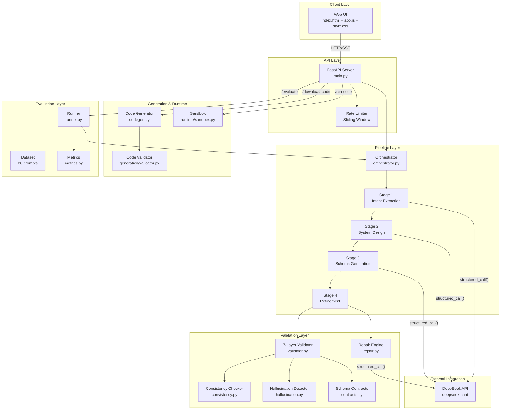
```mermaid
graph TB
    subgraph "Client Layer"
        UI["Web UI<br/>index.html + app.js + style.css"]
    end

    subgraph "API Layer"
        API["FastAPI Server<br/>main.py"]
        RL["Rate Limiter<br/>Sliding Window"]
    end

    subgraph "Pipeline Layer"
        ORCH["Orchestrator<br/>orchestrator.py"]
        S1["Stage 1<br/>Intent Extraction"]
        S2["Stage 2<br/>System Design"]
        S3["Stage 3<br/>Schema Generation"]
        S4["Stage 4<br/>Refinement"]
    end

    subgraph "Validation Layer"
        VAL["7-Layer Validator<br/>validator.py"]
        CON["Consistency Checker<br/>consistency.py"]
        HAL["Hallucination Detector<br/>hallucination.py"]
        REP["Repair Engine<br/>repair.py"]
        SCH["Schema Contracts<br/>contracts.py"]
    end

    subgraph "Generation & Runtime"
        CG["Code Generator<br/>codegen.py"]
        CV["Code Validator<br/>generation/validator.py"]
        SB["Sandbox<br/>runtime/sandbox.py"]
    end

    subgraph "Evaluation Layer"
        DS["Dataset<br/>20 prompts"]
        RUN["Runner<br/>runner.py"]
        MET["Metrics<br/>metrics.py"]
    end

    subgraph "External Integration"
        LLM["DeepSeek API<br/>deepseek-chat"]
    end

    UI -->|"HTTP/SSE"| API
    API --> RL
    API --> ORCH
    ORCH --> S1 --> S2 --> S3 --> S4
    S1 & S2 & S3 -->|"structured_call()"| LLM
    S4 --> VAL
    VAL --> CON & HAL
    VAL --> SCH
    S4 --> REP -->|"structured_call()"| LLM
    API -->|"/download-code"| CG --> CV
    API -->|"/run-code"| SB
    API -->|"/evaluate"| RUN --> MET
    RUN --> ORCH
```

---

## 3. Pipeline Data Flow

The following diagram illustrates the exact data transformations at each stage of the pipeline.

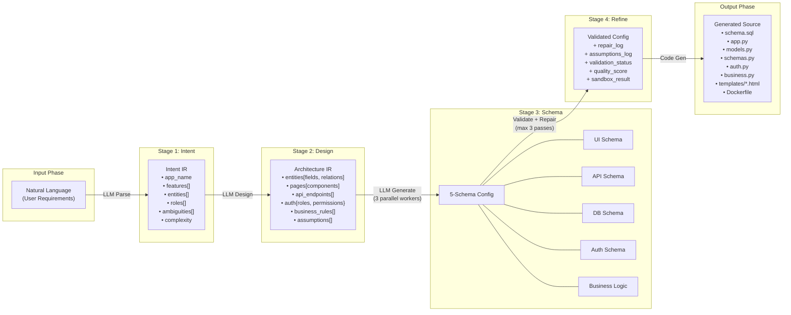
```mermaid
flowchart LR
    subgraph "Input Phase"
        NL["Natural Language<br/>(User Requirements)"]
    end

    subgraph "Stage 1: Intent"
        IR1["Intent IR<br/>• app_name<br/>• features[]<br/>• entities[]<br/>• roles[]<br/>• ambiguities[]<br/>• complexity"]
    end

    subgraph "Stage 2: Design"
        IR2["Architecture IR<br/>• entities[fields, relations]<br/>• pages[components]<br/>• api_endpoints[]<br/>• auth{roles, permissions}<br/>• business_rules[]<br/>• assumptions[]"]
    end

    subgraph "Stage 3: Schema"
        CFG["5-Schema Config"]
        UI_S["UI Schema"]
        API_S["API Schema"]
        DB_S["DB Schema"]
        AUTH_S["Auth Schema"]
        BL_S["Business Logic"]
    end

    subgraph "Stage 4: Refine"
        FINAL["Validated Config<br/>+ repair_log<br/>+ assumptions_log<br/>+ validation_status<br/>+ quality_score<br/>+ sandbox_result"]
    end

    subgraph "Output Phase"
        CODE["Generated Source<br/>• schema.sql<br/>• app.py<br/>• models.py<br/>• schemas.py<br/>• auth.py<br/>• business.py<br/>• templates/*.html<br/>• Dockerfile"]
    end

    NL -->|"LLM Parse"| IR1
    IR1 -->|"LLM Design"| IR2
    IR2 -->|"LLM Generate<br/>(3 parallel workers)"| CFG
    CFG --- UI_S & API_S & DB_S & AUTH_S & BL_S
    CFG -->|"Validate + Repair<br/>(max 3 passes)"| FINAL
    FINAL -->|"Code Gen"| CODE
```

### Intermediate Representation (IR) Characteristics

| Stage | Output | Typical Size | Token Range |
|-------|--------|-------------|-------------|
| Stage 1 | Intent IR | 1-3 KB | 300-800 |
| Stage 2 | Architecture IR | 5-15 KB | 1,500-4,000 |
| Stage 3 | 5-Schema Config | 15-40 KB | 4,000-12,000 |
| Stage 4 | Validated Config | 16-42 KB | 4,200-13,000 |

---

## 4. Module Dependency Graph

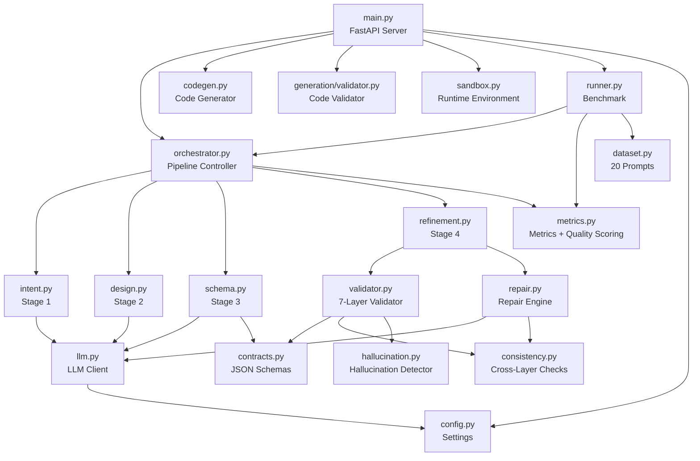
```mermaid
graph TD
    main["main.py<br/>FastAPI Server"]
    config["config.py<br/>Settings"]
    orch["orchestrator.py<br/>Pipeline Controller"]
    intent["intent.py<br/>Stage 1"]
    design["design.py<br/>Stage 2"]
    schema["schema.py<br/>Stage 3"]
    refine["refinement.py<br/>Stage 4"]
    llm["llm.py<br/>LLM Client"]
    
    validator["validator.py<br/>7-Layer Validator"]
    contracts["contracts.py<br/>JSON Schemas"]
    consistency["consistency.py<br/>Cross-Layer Checks"]
    halluc["hallucination.py<br/>Hallucination Detector"]
    repair["repair.py<br/>Repair Engine"]
    
    codegen["codegen.py<br/>Code Generator"]
    codeval["generation/validator.py<br/>Code Validator"]
    sandbox["sandbox.py<br/>Runtime Environment"]
    
    runner["runner.py<br/>Benchmark"]
    metrics["metrics.py<br/>Metrics + Quality Scoring"]
    dataset["dataset.py<br/>20 Prompts"]
    
    main --> orch & codegen & codeval & sandbox & runner
    main --> config
    orch --> intent & design & schema & refine
    orch --> metrics
    intent & design --> llm
    schema --> llm & contracts
    refine --> validator & repair
    validator --> contracts & consistency & halluc
    repair --> llm & consistency
    runner --> orch & metrics & dataset
    llm --> config
```

---

## 5. Sequence Diagrams

### 5.1 Full Pipeline Flow (SSE Streaming)

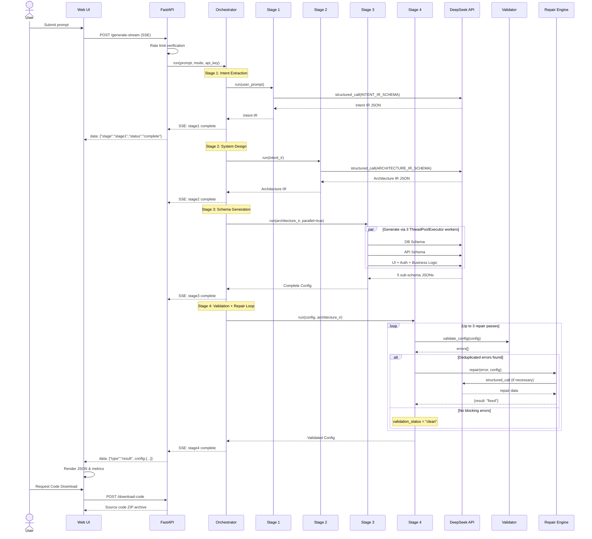
```mermaid
sequenceDiagram
    actor User
    participant UI as Web UI
    participant API as FastAPI
    participant Orch as Orchestrator
    participant S1 as Stage 1
    participant S2 as Stage 2
    participant S3 as Stage 3
    participant S4 as Stage 4
    participant LLM as DeepSeek API
    participant Val as Validator
    participant Rep as Repair Engine

    User->>UI: Submit prompt
    UI->>API: POST /generate-stream (SSE)
    API->>API: Rate limit verification
    API->>Orch: run(prompt, mode, api_key)
    
    Note over Orch: Stage 1: Intent Extraction
    Orch->>S1: run(user_prompt)
    S1->>LLM: structured_call(INTENT_IR_SCHEMA)
    LLM-->>S1: Intent IR JSON
    S1-->>Orch: Intent IR
    Orch-->>API: SSE: stage1 complete
    API-->>UI: data: {"stage":"stage1","status":"complete"}
    
    Note over Orch: Stage 2: System Design
    Orch->>S2: run(intent_ir)
    S2->>LLM: structured_call(ARCHITECTURE_IR_SCHEMA)
    LLM-->>S2: Architecture IR JSON
    S2-->>Orch: Architecture IR
    Orch-->>API: SSE: stage2 complete
    
    Note over Orch: Stage 3: Schema Generation
    Orch->>S3: run(architecture_ir, parallel=true)
    par Generate via 3 ThreadPoolExecutor workers
        S3->>LLM: DB Schema
        S3->>LLM: API Schema
        S3->>LLM: UI + Auth + Business Logic
    end
    LLM-->>S3: 5 sub-schema JSONs
    S3-->>Orch: Complete Config
    Orch-->>API: SSE: stage3 complete
    
    Note over Orch: Stage 4: Validation + Repair Loop
    Orch->>S4: run(config, architecture_ir)
    loop Up to 3 repair passes
        S4->>Val: validate_config(config)
        Val-->>S4: errors[]
        alt Deduplicated errors found
            S4->>Rep: repair(error, config)
            Rep->>LLM: structured_call (if necessary)
            LLM-->>Rep: repair data
            Rep-->>S4: {result: "fixed"}
        else No blocking errors
            Note over S4: validation_status = "clean"
        end
    end
    S4-->>Orch: Validated Config
    Orch-->>API: SSE: stage4 complete
    
    API-->>UI: data: {"type":"result", config:{...}}
    UI->>UI: Render JSON & metrics
    User->>UI: Request Code Download
    UI->>API: POST /download-code
    API-->>UI: Source code ZIP archive
```

### 5.2 Repair Loop Mechanics

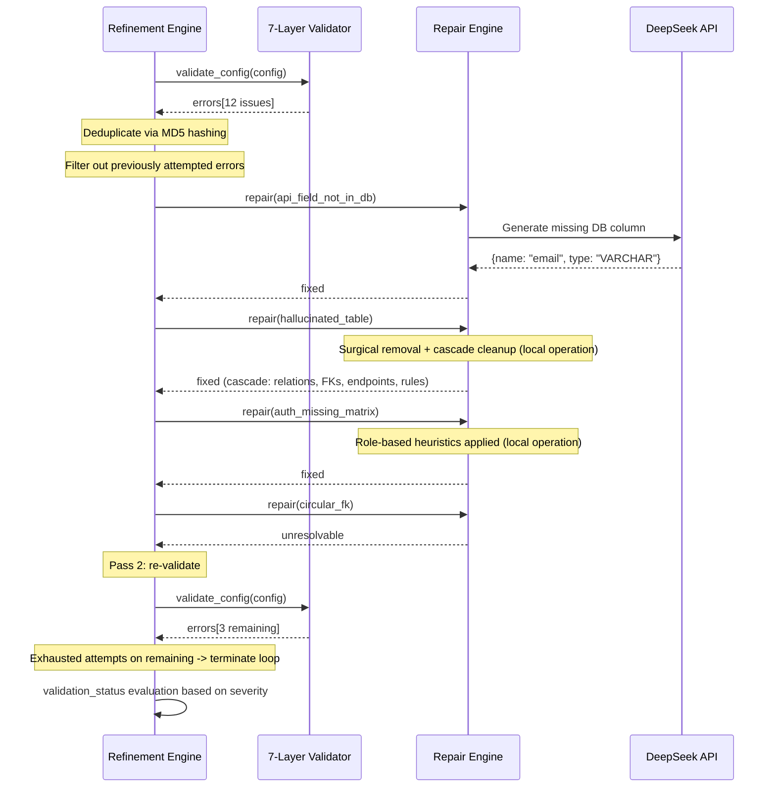
```mermaid
sequenceDiagram
    participant R as Refinement Engine
    participant V as 7-Layer Validator
    participant RE as Repair Engine
    participant LLM as DeepSeek API

    R->>V: validate_config(config)
    V-->>R: errors[12 issues]
    
    Note over R: Deduplicate via MD5 hashing
    Note over R: Filter out previously attempted errors
    
    R->>RE: repair(api_field_not_in_db)
    RE->>LLM: Generate missing DB column
    LLM-->>RE: {name: "email", type: "VARCHAR"}
    RE-->>R: fixed

    R->>RE: repair(hallucinated_table)
    Note over RE: Surgical removal + cascade cleanup (local operation)
    RE-->>R: fixed (cascade: relations, FKs, endpoints, rules)

    R->>RE: repair(auth_missing_matrix)
    Note over RE: Role-based heuristics applied (local operation)
    RE-->>R: fixed

    R->>RE: repair(circular_fk)
    RE-->>R: unresolvable

    Note over R: Pass 2: re-validate
    R->>V: validate_config(config)
    V-->>R: errors[3 remaining]
    Note over R: Exhausted attempts on remaining -> terminate loop
    R->>R: validation_status evaluation based on severity
```

---

## 6. State Machine Diagrams

### 6.1 Pipeline State Machine

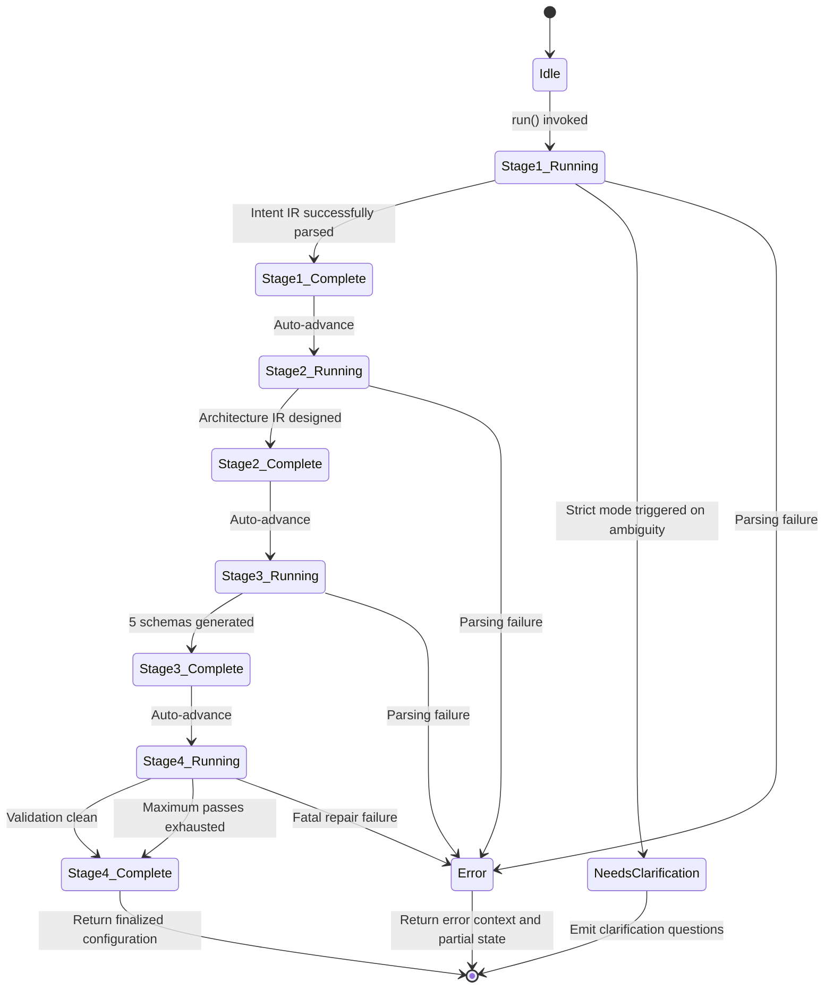
```mermaid
stateDiagram-v2
    [*] --> Idle
    
    Idle --> Stage1_Running: run() invoked
    
    Stage1_Running --> Stage1_Complete: Intent IR successfully parsed
    Stage1_Running --> NeedsClarification: Strict mode triggered on ambiguity
    Stage1_Running --> Error: Parsing failure
    
    NeedsClarification --> [*]: Emit clarification questions
    
    Stage1_Complete --> Stage2_Running: Auto-advance
    Stage2_Running --> Stage2_Complete: Architecture IR designed
    Stage2_Running --> Error: Parsing failure
    
    Stage2_Complete --> Stage3_Running: Auto-advance
    Stage3_Running --> Stage3_Complete: 5 schemas generated
    Stage3_Running --> Error: Parsing failure
    
    Stage3_Complete --> Stage4_Running: Auto-advance
    Stage4_Running --> Stage4_Complete: Validation clean
    Stage4_Running --> Stage4_Complete: Maximum passes exhausted
    Stage4_Running --> Error: Fatal repair failure
    
    Stage4_Complete --> [*]: Return finalized configuration
    Error --> [*]: Return error context and partial state
```

### 6.2 Validation Status State Machine

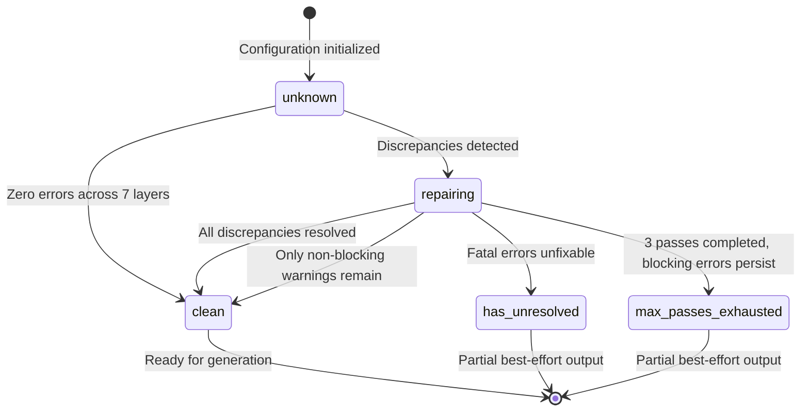
```mermaid
stateDiagram-v2
    [*] --> unknown: Configuration initialized
    
    unknown --> clean: Zero errors across 7 layers
    unknown --> repairing: Discrepancies detected
    
    repairing --> clean: All discrepancies resolved
    repairing --> clean: Only non-blocking warnings remain
    repairing --> has_unresolved: Fatal errors unfixable
    repairing --> max_passes_exhausted: 3 passes completed, blocking errors persist
    
    clean --> [*]: Ready for generation
    has_unresolved --> [*]: Partial best-effort output
    max_passes_exhausted --> [*]: Partial best-effort output
```

### 6.3 Repair Engine Decision Tree

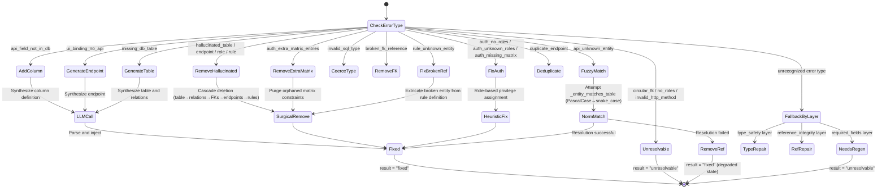
```mermaid
stateDiagram-v2
    [*] --> CheckErrorType

    CheckErrorType --> AddColumn: api_field_not_in_db
    CheckErrorType --> GenerateEndpoint: ui_binding_no_api
    CheckErrorType --> RemoveHallucinated: hallucinated_table / endpoint / role / rule
    CheckErrorType --> FixAuth: auth_no_roles / auth_unknown_roles / auth_missing_matrix
    CheckErrorType --> RemoveExtraMatrix: auth_extra_matrix_entries
    CheckErrorType --> CoerceType: invalid_sql_type
    CheckErrorType --> RemoveFK: broken_fk_reference
    CheckErrorType --> GenerateTable: missing_db_table
    CheckErrorType --> FuzzyMatch: api_unknown_entity
    CheckErrorType --> Deduplicate: duplicate_endpoint
    CheckErrorType --> FixBrokenRef: rule_unknown_entity
    CheckErrorType --> Unresolvable: circular_fk / no_roles / invalid_http_method
    CheckErrorType --> FallbackByLayer: unrecognized error type

    AddColumn --> LLMCall: Synthesize column definition
    GenerateEndpoint --> LLMCall: Synthesize endpoint
    GenerateTable --> LLMCall: Synthesize table and relations
    RemoveHallucinated --> SurgicalRemove: Cascade deletion (table→relations→FKs→endpoints→rules)
    FixAuth --> HeuristicFix: Role-based privilege assignment
    RemoveExtraMatrix --> SurgicalRemove: Purge orphaned matrix constraints
    FuzzyMatch --> NormMatch: Attempt _entity_matches_table (PascalCase→snake_case)
    FixBrokenRef --> SurgicalRemove: Extricate broken entity from rule definition
    
    LLMCall --> Fixed: Parse and inject
    SurgicalRemove --> Fixed
    HeuristicFix --> Fixed
    NormMatch --> Fixed: Resolution successful
    NormMatch --> RemoveRef: Resolution failed
    FallbackByLayer --> TypeRepair: type_safety layer
    FallbackByLayer --> RefRepair: reference_integrity layer
    FallbackByLayer --> NeedsRegen: required_fields layer
    
    Fixed --> [*]: result = "fixed"
    Unresolvable --> [*]: result = "unresolvable"
    RemoveRef --> [*]: result = "fixed" (degraded state)
    NeedsRegen --> [*]: result = "unresolvable"
```

---

## 7. Class Diagrams

### 7.1 Core Orchestration Classes

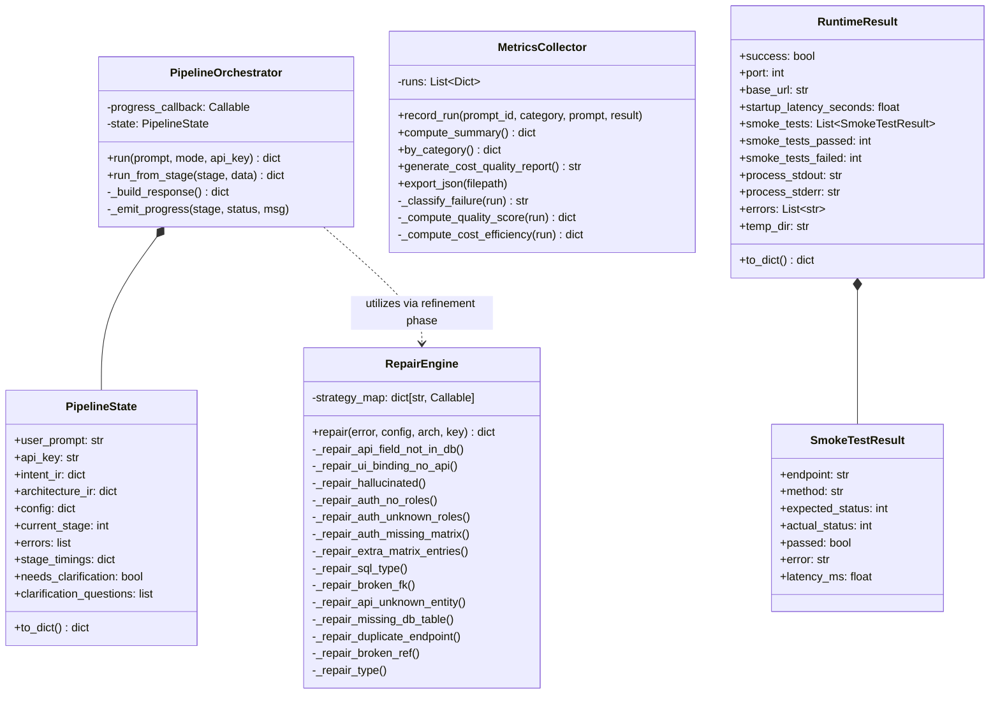
```mermaid
classDiagram
    class PipelineOrchestrator {
        -progress_callback: Callable
        -state: PipelineState
        +run(prompt, mode, api_key) dict
        +run_from_stage(stage, data) dict
        -_build_response() dict
        -_emit_progress(stage, status, msg)
    }
    
    class PipelineState {
        +user_prompt: str
        +api_key: str
        +intent_ir: dict
        +architecture_ir: dict
        +config: dict
        +current_stage: int
        +errors: list
        +stage_timings: dict
        +needs_clarification: bool
        +clarification_questions: list
        +to_dict() dict
    }
    
    class RepairEngine {
        +repair(error, config, arch, key) dict
        -strategy_map: dict[str, Callable]
        -_repair_api_field_not_in_db()
        -_repair_ui_binding_no_api()
        -_repair_hallucinated()
        -_repair_auth_no_roles()
        -_repair_auth_unknown_roles()
        -_repair_auth_missing_matrix()
        -_repair_extra_matrix_entries()
        -_repair_sql_type()
        -_repair_broken_fk()
        -_repair_api_unknown_entity()
        -_repair_missing_db_table()
        -_repair_duplicate_endpoint()
        -_repair_broken_ref()
        -_repair_type()
    }
    
    class MetricsCollector {
        -runs: List~Dict~
        +record_run(prompt_id, category, prompt, result)
        +compute_summary() dict
        +by_category() dict
        +generate_cost_quality_report() str
        +export_json(filepath)
        -_classify_failure(run) str
        -_compute_quality_score(run) dict
        -_compute_cost_efficiency(run) dict
    }
    
    class RuntimeResult {
        +success: bool
        +port: int
        +base_url: str
        +startup_latency_seconds: float
        +smoke_tests: List~SmokeTestResult~
        +smoke_tests_passed: int
        +smoke_tests_failed: int
        +process_stdout: str
        +process_stderr: str
        +errors: List~str~
        +temp_dir: str
        +to_dict() dict
    }
    
    class SmokeTestResult {
        +endpoint: str
        +method: str
        +expected_status: int
        +actual_status: int
        +passed: bool
        +error: str
        +latency_ms: float
    }
    
    PipelineOrchestrator *-- PipelineState
    PipelineOrchestrator ..> RepairEngine : utilizes via refinement phase
    RuntimeResult *-- SmokeTestResult
```

---

## 8. Component Architecture

### 8.1 Package Module Map

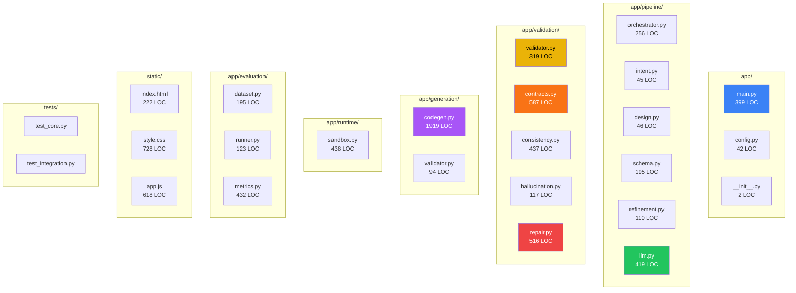
```mermaid
graph TB
    subgraph "app/"
        main["main.py<br/>399 LOC"]
        config["config.py<br/>42 LOC"]
        init["__init__.py<br/>2 LOC"]
    end

    subgraph "app/pipeline/"
        orch["orchestrator.py<br/>256 LOC"]
        intent["intent.py<br/>45 LOC"]
        design["design.py<br/>46 LOC"]
        schema_mod["schema.py<br/>195 LOC"]
        refine["refinement.py<br/>110 LOC"]
        llm["llm.py<br/>419 LOC"]
    end

    subgraph "app/validation/"
        validator["validator.py<br/>319 LOC"]
        contracts["contracts.py<br/>587 LOC"]
        consistency["consistency.py<br/>437 LOC"]
        hallucination["hallucination.py<br/>117 LOC"]
        repair["repair.py<br/>516 LOC"]
    end

    subgraph "app/generation/"
        codegen["codegen.py<br/>1919 LOC"]
        codeval["validator.py<br/>94 LOC"]
    end

    subgraph "app/runtime/"
        sandbox["sandbox.py<br/>438 LOC"]
    end

    subgraph "app/evaluation/"
        dataset["dataset.py<br/>195 LOC"]
        runner["runner.py<br/>123 LOC"]
        metrics["metrics.py<br/>432 LOC"]
    end

    subgraph "static/"
        html["index.html<br/>222 LOC"]
        css["style.css<br/>728 LOC"]
        js["app.js<br/>618 LOC"]
    end

    subgraph "tests/"
        test_core["test_core.py"]
        test_int["test_integration.py"]
    end

    style main fill:#3b82f6,color:#fff
    style llm fill:#22c55e,color:#fff
    style contracts fill:#f97316,color:#fff
    style repair fill:#ef4444,color:#fff
    style validator fill:#eab308,color:#000
    style codegen fill:#a855f7,color:#fff
```

### 8.2 Lines of Code Distribution

| Package | Files | LOC | Proportion |
|---------|-------|-----|------------|
| `app/pipeline/` | 6 | 1,071 | 12.9% |
| `app/validation/` | 5 | 1,976 | 23.9% |
| `app/generation/` | 2 | 2,013 | 24.3% |
| `app/evaluation/` | 3 | 750 | 9.1% |
| `app/runtime/` | 1 | 438 | 5.3% |
| `app/` (root) | 3 | 443 | 5.4% |
| `static/` | 3 | 1,568 | 19.0% |
| **Total** | **23** | **8,259** | **100%** |

*(Note: Test file counts excluded from primary proportion metrics)*

> The **code generator (`codegen.py` at 1,919 LOC) serves as the most substantial individual module**, followed closely by the **validation subsystem** collectively comprising 1,976 LOC. The integration of generation and validation architectures constitutes roughly 48% of the application footprint, emphasizing the priority of output precision and correctness.

---

## 9. Validation Engine Architecture

### 9.1 Seven Validation Layers

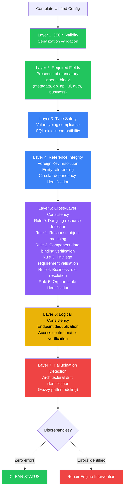
```mermaid
flowchart TB
    CONFIG["Complete Unified Config"]
    
    CONFIG --> L1["Layer 1: JSON Validity<br/>Serialization validation"]
    L1 --> L2["Layer 2: Required Fields<br/>Presence of mandatory schema blocks<br/>(metadata, db, api, ui, auth, business)"]
    L2 --> L3["Layer 3: Type Safety<br/>Value typing compliance<br/>SQL dialect compatibility"]
    L3 --> L4["Layer 4: Reference Integrity<br/>Foreign Key resolution<br/>Entity referencing<br/>Circular dependency identification"]
    L4 --> L5["Layer 5: Cross-Layer Consistency<br/>Rule 0: Dangling resource detection<br/>Rule 1: Response object matching<br/>Rule 2: Component data binding verification<br/>Rule 3: Privilege requirement validation<br/>Rule 4: Business rule resolution<br/>Rule 5: Orphan table identification"]
    L5 --> L6["Layer 6: Logical Consistency<br/>Endpoint deduplication<br/>Access control matrix verification"]
    L6 --> L7["Layer 7: Hallucination Detection<br/>Architectural drift identification<br/>(Fuzzy path modeling)"]
    
    L7 --> RESULT{"Discrepancies?"}
    RESULT -->|"Zero errors"| CLEAN["CLEAN STATUS"]
    RESULT -->|"Errors identified"| REPAIR["Repair Engine Intervention"]
    
    style L1 fill:#22c55e,color:#fff
    style L2 fill:#22c55e,color:#fff
    style L3 fill:#3b82f6,color:#fff
    style L4 fill:#3b82f6,color:#fff
    style L5 fill:#8b5cf6,color:#fff
    style L6 fill:#eab308,color:#000
    style L7 fill:#ef4444,color:#fff
    style CLEAN fill:#22c55e,color:#fff
    style REPAIR fill:#ef4444,color:#fff
```

### 9.2 Cross-Layer Consistency Evaluation (Layer 5)

The consistency checker implements six distinct rules, employing sophisticated nomenclature normalization:

- **`_camel_to_snake()`**: Unifies casing conventions (e.g., `CartItem` → `cart_item`)
- **`_entity_matches_table()`**: Handles pluralization logic and substring prefixes
- **Path Segments Exclusions**: Segregates behavioral endpoints (`login`, `search`) from resource paths

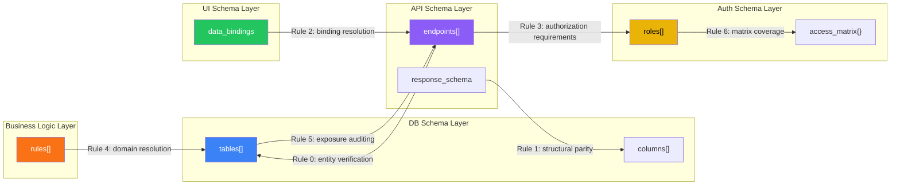
```mermaid
graph LR
    subgraph "DB Schema Layer"
        T1["tables[]"]
        C1["columns[]"]
    end

    subgraph "API Schema Layer"
        E1["endpoints[]"]
        RS["response_schema"]
    end

    subgraph "UI Schema Layer"
        DB["data_bindings"]
    end

    subgraph "Auth Schema Layer"
        RO["roles[]"]
        AM["access_matrix{}"]
    end

    subgraph "Business Logic Layer"
        BR["rules[]"]
    end

    E1 -->|"Rule 0: entity verification"| T1
    RS -->|"Rule 1: structural parity"| C1
    DB -->|"Rule 2: binding resolution"| E1
    E1 -->|"Rule 3: authorization requirements"| RO
    RO -->|"Rule 6: matrix coverage"| AM
    BR -->|"Rule 4: domain resolution"| T1
    T1 -->|"Rule 5: exposure auditing"| E1

    style T1 fill:#3b82f6,color:#fff
    style E1 fill:#8b5cf6,color:#fff
    style DB fill:#22c55e,color:#fff
    style RO fill:#eab308,color:#000
    style BR fill:#f97316,color:#fff
```

---

## 10. Repair Engine Strategy Pattern

The `RepairEngine` utilizes a precise **strategy map pattern**. Handlers are functionally partitioned into computationally generated repairs and heuristic local resolutions.

### LLM-Assisted Repairs (3)
- `api_field_not_in_db` → Instructs LLM to synthesize column definition satisfying `FIELD_SCHEMA`.
- `ui_binding_no_api` → Instructs LLM to synthesize an endpoint fulfilling `API_ENDPOINT_SCHEMA`.
- `missing_db_table` → Instructs LLM to synthesize comprehensive table configurations and structural relations.

### Heuristic Resolutions (11)
- `hallucinated_table` → Execution of cascading purge: table → relations → keys → endpoints → rules.
- `hallucinated_endpoint` → Immediate endpoint excision.
- `hallucinated_role` → Role nullification and matrix reconciliation.
- `hallucinated_rule` → Rule nullification.
- `auth_no_roles` → Broad deployment of baseline roles to unprotected resources.
- `auth_unknown_roles` → Instantiation of missing roles with baseline privilege parameters.
- `auth_missing_matrix` → Procedural generation of matrix entries (e.g., administrative CRUD allocation).
- `auth_extra_matrix_entries` → Excision of orphaned security mappings.
- `invalid_sql_type` → Coercion to baseline string formatting.
- `broken_fk_reference` → Decoupling of constraint annotations.
- `api_unknown_entity` → Application of fuzzy resolution protocol, followed by parameter removal if failed.
- `duplicate_endpoint` → Deduplication indexing by `(method, path)` tuple structure.
- `rule_unknown_entity` → Decoupling of invalid entity signatures.

### Non-Resolvable Conditions (3)
- `circular_fk` → Mandates fundamental schema reorganization.
- `no_roles_defined` → Requires total regeneration.
- `invalid_http_method` → Requires total regeneration.

---

## 11. Data Schema Contracts (ERD)

### 11.1 Intent IR Specification

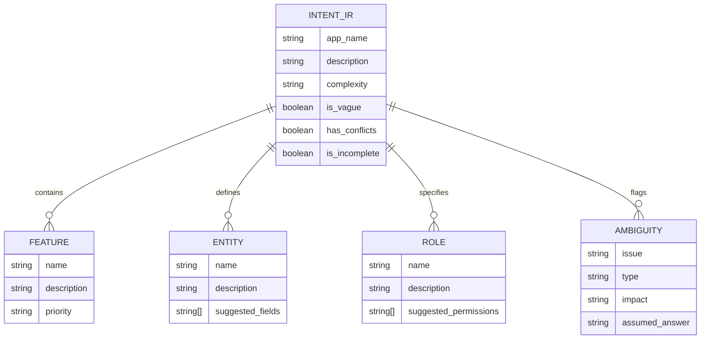
```mermaid
erDiagram
    INTENT_IR {
        string app_name
        string description
        string complexity
        boolean is_vague
        boolean has_conflicts
        boolean is_incomplete
    }
    
    FEATURE {
        string name
        string description
        string priority
    }
    
    ENTITY {
        string name
        string description
        string[] suggested_fields
    }
    
    ROLE {
        string name
        string description
        string[] suggested_permissions
    }
    
    AMBIGUITY {
        string issue
        string type
        string impact
        string assumed_answer
    }
    
    INTENT_IR ||--o{ FEATURE : "contains"
    INTENT_IR ||--o{ ENTITY : "defines"
    INTENT_IR ||--o{ ROLE : "specifies"
    INTENT_IR ||--o{ AMBIGUITY : "flags"
```

### 11.2 Architecture IR Specification

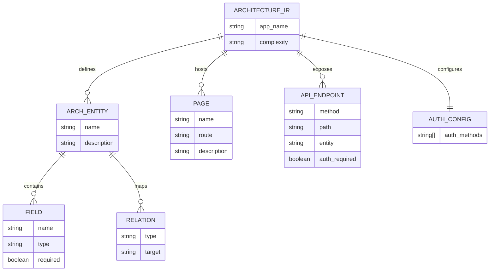
```mermaid
erDiagram
    ARCHITECTURE_IR {
        string app_name
        string complexity
    }
    
    ARCH_ENTITY {
        string name
        string description
    }
    
    FIELD {
        string name
        string type
        boolean required
    }
    
    RELATION {
        string type
        string target
    }
    
    PAGE {
        string name
        string route
        string description
    }
    
    API_ENDPOINT {
        string method
        string path
        string entity
        boolean auth_required
    }
    
    AUTH_CONFIG {
        string[] auth_methods
    }
    
    ARCHITECTURE_IR ||--o{ ARCH_ENTITY : "defines"
    ARCH_ENTITY ||--o{ FIELD : "contains"
    ARCH_ENTITY ||--o{ RELATION : "maps"
    ARCHITECTURE_IR ||--o{ PAGE : "hosts"
    ARCHITECTURE_IR ||--o{ API_ENDPOINT : "exposes"
    ARCHITECTURE_IR ||--|| AUTH_CONFIG : "configures"
```

---

## 12. Concurrency Model

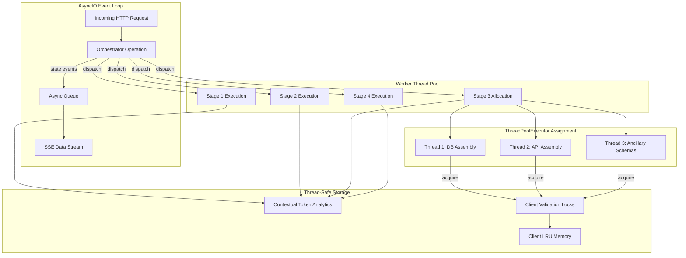
```mermaid
graph TB
    subgraph "AsyncIO Event Loop"
        REQ["Incoming HTTP Request"]
        ORCH["Orchestrator Operation"]
        SSE["SSE Data Stream"]
        QUEUE["Async Queue"]
    end
    
    subgraph "Worker Thread Pool"
        S1["Stage 1 Execution"]
        S2["Stage 2 Execution"]
        S3_MAIN["Stage 3 Allocation"]
        S4["Stage 4 Execution"]
    end
    
    subgraph "ThreadPoolExecutor Assignment"
        W1["Thread 1: DB Assembly"]
        W2["Thread 2: API Assembly"]
        W3["Thread 3: Ancillary Schemas"]
    end
    
    subgraph "Thread-Safe Storage"
        CTX["Contextual Token Analytics"]
        LOCK["Client Validation Locks"]
        CACHE["Client LRU Memory"]
    end
    
    REQ --> ORCH
    ORCH -->|"dispatch"| S1
    ORCH -->|"dispatch"| S2
    ORCH -->|"dispatch"| S3_MAIN
    ORCH -->|"dispatch"| S4
    
    S3_MAIN --> W1 & W2 & W3
    
    ORCH -->|"state events"| QUEUE --> SSE
    
    W1 & W2 & W3 -->|"acquire"| LOCK --> CACHE
    S1 & S2 & S3_MAIN & S4 --> CTX
```

### Concurrency Mechanisms

| Implementation | Location | Utility |
|----------------|----------|---------|
| `asyncio.to_thread()` | Orchestrator pipeline | Prevents thread blocking during extensive external API synchronization. |
| `ThreadPoolExecutor(3)` | Schema assembly protocol | Manages parallelized request distributions for structural assemblies. |
| `threading.Lock` | Client memory configuration | Guarantees operational isolation during high-throughput requests. |
| `contextvars.ContextVar` | Analytics tracking | Provides encapsulated metric isolation for concurrent pipeline executions. |
| `asyncio.Queue` | Streaming infrastructure | Facilitates uninterrupted Event Stream persistence to the frontend client. |
| `asyncio.Lock` | Rate limitation | Safeguards sliding window computations. |

---

## 13. API Endpoint Map

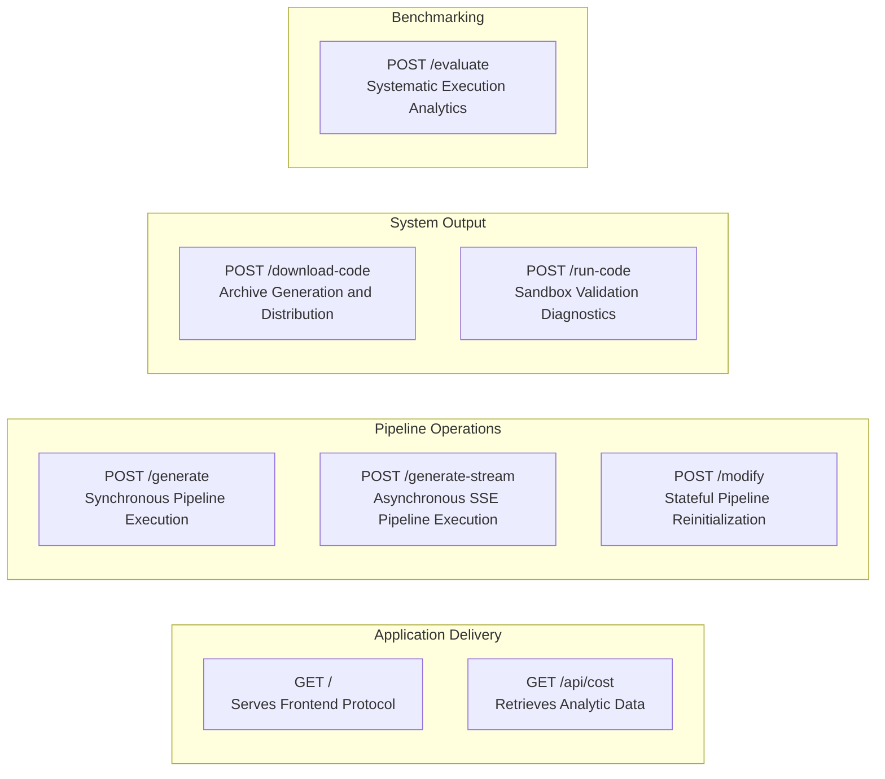
```mermaid
graph LR
    subgraph "Application Delivery"
        GET_ROOT["GET /<br/>Serves Frontend Protocol"]
        GET_COST["GET /api/cost<br/>Retrieves Analytic Data"]
    end

    subgraph "Pipeline Operations"
        POST_GEN["POST /generate<br/>Synchronous Pipeline Execution"]
        POST_SSE["POST /generate-stream<br/>Asynchronous SSE Pipeline Execution"]
        POST_MOD["POST /modify<br/>Stateful Pipeline Reinitialization"]
    end

    subgraph "System Output"
        POST_DL["POST /download-code<br/>Archive Generation and Distribution"]
        POST_RUN["POST /run-code<br/>Sandbox Validation Diagnostics"]
    end

    subgraph "Benchmarking"
        POST_EVAL["POST /evaluate<br/>Systematic Execution Analytics"]
    end
```

| Endpoint | Protocol | Rate Limited | Auth Required | Expected Output |
|----------|----------|--------------|---------------|-----------------|
| `/` | GET | False | False | Interface structure (HTML) |
| `/generate` | POST | True | Application Key | Configuration metadata (JSON) |
| `/generate-stream` | POST | True | Application Key | Progressive events (SSE) |
| `/modify` | POST | True | Application Key | Modified metadata (JSON) |
| `/download-code` | POST | False | False | Source code hierarchy (ZIP) |
| `/run-code` | POST | False | False | Sandbox execution metrics (JSON) |
| `/evaluate` | POST | True | False | Benchmark diagnostics (JSON) |
| `/api/cost` | GET | False | False | Resource analytics (JSON) |

---

## 14. Design Patterns Used

### Structural Implementations

| Pattern Classification | Location | Engineering Purpose |
|------------------------|----------|---------------------|
| **Pipeline** | `orchestrator.py` | Directs the primary four-stage data transformation protocol. |
| **Strategy** | `repair.py` | Distributes targeted repair algorithms across seventeen distinct validation discrepancies. |
| **Chain of Responsibility**| `validator.py` | Enforces the sequential seven-layer compliance verification module. |
| **Observer** | `orchestrator.py` | Informs external components of structural changes and pipeline state transitions. |
| **Factory** | `llm.py` | Manages efficient instantiation and secure caching of API communication objects. |
| **Adapter** | `llm.py` | Normalizes and rectifies inconsistent JSON outputs generated by the external language model. |
| **Facade** | `orchestrator.py` | Encapsulates profound pipeline complexity behind a singular interface execution sequence. |
| **Template Method** | `schema.py` | Standardizes the sequential generation of five independent schema formats via ThreadPool mapping. |
| **Schema-First** | `contracts.py` | Mandates JSON Schema structural configurations as the absolute source of truth. |
| **Dataclass Pattern** | `sandbox.py` | Implements rigorous structuring of diagnostic execution and verification outputs. |

---

## 15. Software Engineering Metrics

### 15.1 Quality Score Computations

The application evaluates processing proficiency utilizing a composite mathematical score (ranging 0-100) factoring six weighted vectors:

| Analytical Dimension | Assigned Weight | Evaluation Target |
|----------------------|-----------------|-------------------|
| `schema_completeness`| 0.20 | Validates generation of all fundamental configuration structures. |
| `validation_pass_rate`| 0.25 | Calculates precision metrics (Clean=100, Partial=50, Degraded=30). |
| `repair_effectiveness`| 0.15 | Audits systemic reliance on self-healing modules and algorithm performance. |
| `code_executability` | 0.25 | Evaluates success capabilities through the seven-layer compliance engine. |
| `clarity_detection` | 0.10 | Grades efficacy of the intent identification layer on incomplete input requests. |
| `conflict_detection` | 0.05 | Measures recognition success of structurally paradoxical requirements. |

### 15.2 Structural Code Metrics

| Metric Classification | Evaluation | Contextual Justification |
|-----------------------|------------|--------------------------|
| **Component Coupling**| Negligible | Primary architecture communicates strictly via structured JSON Intermediary Representations. |
| **Component Cohesion**| Superior | Operational scope strictly bound by module (e.g., exclusively execution-focused runner). |
| **Cyclomatic Complexity**| Substantial | Predictably elevated within the `codegen.py` file addressing intensive template structuring, and `consistency.py` managing intersecting validation algorithms. |
| **Schema Uniformity** | 100% | Universal compliance managed and strictly enforced by `contracts.py`. |
| **Error Recovery Scope**| Comprehensive| Guaranteed execution continuity via seventeen tailored structural repair directives. |

---

## 16. Security Architecture

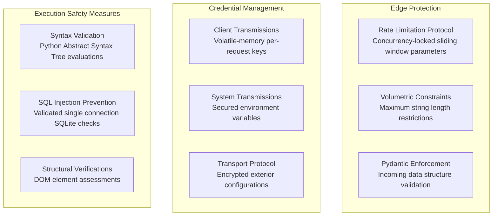
```mermaid
graph TB
    subgraph "Edge Protection"
        RL["Rate Limitation Protocol<br/>Concurrency-locked sliding window parameters"]
        ML["Volumetric Constraints<br/>Maximum string length restrictions"]
        PV["Pydantic Enforcement<br/>Incoming data structure validation"]
    end

    subgraph "Credential Management"
        UK["Client Transmissions<br/>Volatile-memory per-request keys"]
        SK["System Transmissions<br/>Secured environment variables"]
        TR["Transport Protocol<br/>Encrypted exterior configurations"]
    end

    subgraph "Execution Safety Measures"
        AST["Syntax Validation<br/>Python Abstract Syntax Tree evaluations"]
        SQL["SQL Injection Prevention<br/>Validated single connection SQLite checks"]
        HTML["Structural Verifications<br/>DOM element assessments"]
    end
```

### Rate Limitation Protocol

The infrastructure incorporates a computationally sound sliding window sequence limiting interface throughput:

- Strict enforcement of a 5 request ceiling every 60 temporal seconds.
- Asynchronous elimination of dormant tracking states running at specified `CLEANUP_INTERVAL`s.
- Robust concurrent isolation guaranteed through `asyncio.Lock` applications.

---

## 17. Error Handling Strategy

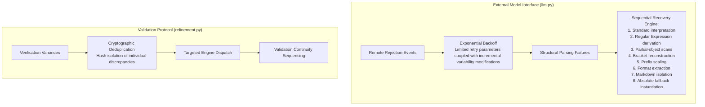
```mermaid
graph TB
    subgraph "External Model Interface (llm.py)"
        LLM_E["Remote Rejection Events"]
        LLM_E --> RETRY["Exponential Backoff<br/>Limited retry parameters coupled with incremental variability modifications"]
        RETRY --> PARSE["Structural Parsing Failures"]
        PARSE --> RECOVER["Sequential Recovery Engine:<br/>1. Standard interpretation<br/>2. Regular Expression derivation<br/>3. Partial-object scans<br/>4. Bracket reconstruction<br/>5. Prefix scaling<br/>6. Format extraction<br/>7. Markdown isolation<br/>8. Absolute fallback instantiation"]
    end

    subgraph "Validation Protocol (refinement.py)"
        V_E["Verification Variances"]
        V_E --> DEDUP["Cryptographic Deduplication<br/>Hash isolation of individual discrepancies"]
        DEDUP --> REPAIR["Targeted Engine Dispatch"]
        REPAIR --> REVALIDATE["Validation Continuity Sequencing"]
    end
```

### Extraneous Data Recovery Protocol

The external LLM interface actively deploys an 8-stage algorithmic sequence built to reconstruct unparsable model outputs into structured code. This resilient execution chain evaluates variables sequentially until structurally sound JSON can be finalized or nullified to an empty fallback container.

---

## 18. Deployment Architecture

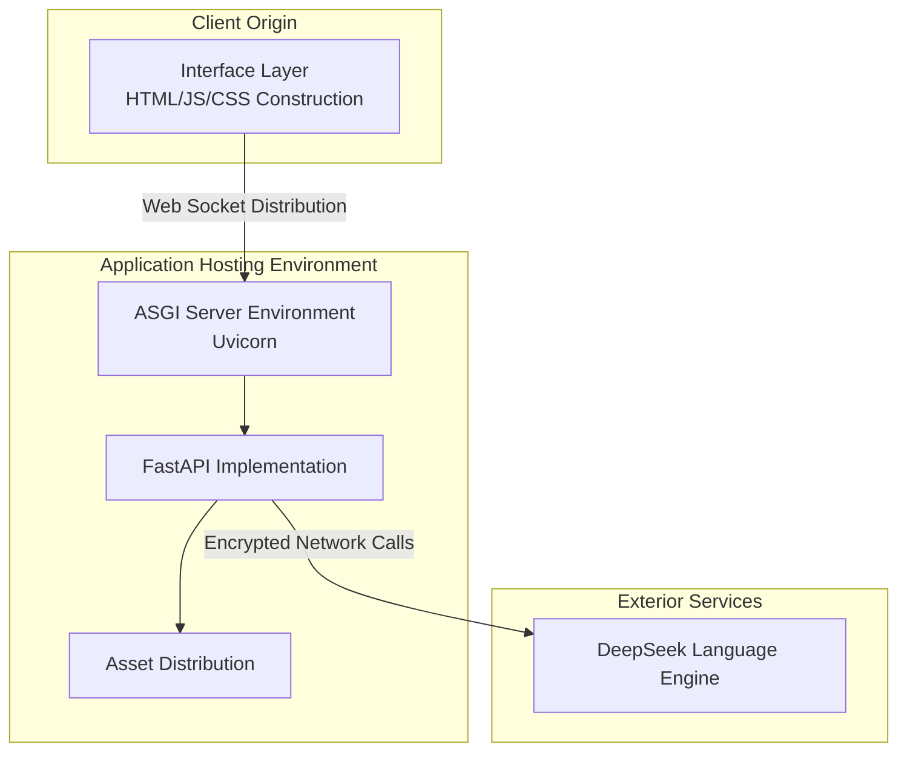
```mermaid
graph TB
    subgraph "Client Origin"
        BROWSER["Interface Layer<br/>HTML/JS/CSS Construction"]
    end
    
    subgraph "Application Hosting Environment"
        UVICORN["ASGI Server Environment<br/>Uvicorn"]
        FASTAPI["FastAPI Implementation"]
        STATIC["Asset Distribution"]
    end
    
    subgraph "Exterior Services"
        DEEPSEEK["DeepSeek Language Engine"]
    end
    
    BROWSER -->|"Web Socket Distribution"| UVICORN
    UVICORN --> FASTAPI
    FASTAPI --> STATIC
    FASTAPI -->|"Encrypted Network Calls"| DEEPSEEK
```

### Runtime Verification Operations

The sandboxed execution environment strictly enforces an eight-phase operational procedure:

1. **Environmental Provisioning** — Isolation of operations within temporal file storage directories.
2. **Library Configuration** — Asynchronous assembly of prerequisite library resources.
3. **Storage Instantiation** — Database structuring executed dynamically within active memory limits.
4. **Execution Protocol** — Launch sequences separated from initial application configurations.
5. **System Validation** — Recurrent connection polling deployed across established temporal bounds.
6. **Interaction Simulations** — End-to-end integration verifications skipping authorized barriers.
7. **Temporal Preservation** — Parameterized persistence variables to allow physical interactions.
8. **Sanitization Protocol** — Rigorous asynchronous elimination of generated assets upon session completion.

---

## 19. Code Generator Architecture

The Code Generation module (`codegen.py`), acting as the primary assembly engine at 1,919 LOC, constructs a minimum of 8 distinct fully-operable elements.

### Generated Artifacts

| Output Identification | Implementation Function | Engineering Application |
|-----------------------|-------------------------|-------------------------|
| `schema.sql` | `_generate_sql()` | Absolute SQLite Data Definition Language with explicit structural restrictions. |
| `models.py` | `_generate_models()` | Object-Relational mappings defined through explicit programmatic connections. |
| `app.py` | `_generate_app()` | Core execution scripts, managing interface renderings and primary CRUD pipelines. |
| `schemas.py` | `_generate_schemas()` | Pydantic data structuring classes utilized for interior API verifications. |
| `auth.py` | `_generate_auth()` | Token-based security and hierarchical privilege assignment modules. |
| `business.py` | `_generate_business_logic()` | Parameter enforcement routines linked strictly to domain conditions. |
| `requirements.txt` | `_generate_requirements()` | Mandatory functional library designations mapping dependency necessities. |
| `Dockerfile` | `_generate_dockerfile()` | Deployment container specifications. |
| `templates/*.html` | `_generate_page_template()` | Core interface scripts embedding integrated data parameters. |

### Assembly Characteristics

- **Dynamic Relationship Inference** (`_derive_fk_from_relations()`): Resolves referential structural constraints programmatically prior to database instantiation.
- **Nomenclature Synchronization** (`_match_entity_to_table()`): Implements consistent lexical structuring across all intersecting code domains.
- **Primary Marker Recognition** (`_infer_pk_type_for_entity()`): Automates type specifications across unique identification parameters.
- **Server Component Structuring** (`_build_server_page()`): Formats data directly through application components.
- **Parametric Data Seeding** (`_generate_seed_data()`): Establishes test cases populated symmetrically to data bounds.

---

## Appendix: Implementation File Index

| File Pathway | LOC Evaluation | Primary Implementation Scope |
|--------------|----------------|------------------------------|
| `app/main.py` | 399 | Central routing operations, rate structuring, archive dispatchers. |
| `app/config.py` | 42 | Absolute parameter and systemic constant configuration storage. |
| `app/pipeline/orchestrator.py` | 256 | Central procedural execution framework across asynchronous data transfers. |
| `app/pipeline/intent.py` | 45 | Primary Stage 1 analytical breakdown processor. |
| `app/pipeline/design.py` | 46 | Primary Stage 2 system architecture generator. |
| `app/pipeline/schema.py` | 195 | Primary Stage 3 threading protocol and configuration packager. |
| `app/pipeline/refinement.py` | 110 | Primary Stage 4 deduplication tracking and analytical execution sequences. |
| `app/pipeline/llm.py` | 419 | Interface synchronization layer featuring robust fallback processing architectures. |
| `app/validation/contracts.py` | 587 | Enforced systemic parameters formatted exclusively as JSON Schema architectures. |
| `app/validation/validator.py` | 319 | Sequential seven-layer analytical engine interface. |
| `app/validation/consistency.py` | 437 | Advanced lexical synchronization and structural auditing sequence. |
| `app/validation/hallucination.py` | 117 | Algorithmic domain restriction and containment validator. |
| `app/validation/repair.py` | 516 | Targeted procedural implementation algorithms processing explicit system variances. |
| `app/generation/codegen.py` | 1,919 | Procedural language structural implementation and translation engine. |
| `app/generation/validator.py` | 94 | Analytical syntax auditing and diagnostic script. |
| `app/runtime/sandbox.py` | 438 | Sandboxed performance verification execution protocol. |
| `app/evaluation/dataset.py` | 195 | Central analytical repository and execution sequence parameters. |
| `app/evaluation/runner.py` | 123 | Independent analytical automation utility. |
| `app/evaluation/metrics.py` | 432 | Computational statistics execution algorithms parsing output variability. |
| `static/index.html` | 222 | Explicit structural DOM instantiation commands for the frontend interface. |
| `static/style.css` | 728 | Visual display specifications and interface styling parameter protocols. |
| `static/app.js` | 618 | Interface behavior controls and operational SSE processing sequences. |
| `tests/test_core.py` | N/A | Base configuration assertions and unit evaluation tests. |
| `tests/test_integration.py` | N/A | Subsystem synchronization verification tests. |
