# 🏗️ App Compiler — Software Architecture Documentation

> **System**: AI-Powered Software Generation Compiler  
> **Architecture Pattern**: Multi-Stage Pipeline (Compiler-Inspired)  
> **Version**: 1.1.0  
> **Last Updated**: 2026-06-05  

---

## Table of Contents

1. [System Overview](#1-system-overview)
2. [High-Level Architecture](#2-high-level-architecture)
3. [Pipeline Data Flow](#3-pipeline-data-flow)
4. [Module Dependency Graph](#4-module-dependency-graph)
5. [Sequence Diagrams](#5-sequence-diagrams)
6. [State Machine Diagrams](#6-state-machine-diagrams)
7. [Class Diagrams](#7-class-diagrams)
8. [Component Architecture](#8-component-architecture)
9. [Validation Engine Architecture](#9-validation-engine-architecture)
10. [Repair Engine Strategy Pattern](#10-repair-engine-strategy-pattern)
11. [Data Schema Contracts (ERD)](#11-data-schema-contracts-erd)
12. [Concurrency Model](#12-concurrency-model)
13. [API Endpoint Map](#13-api-endpoint-map)
14. [Design Patterns Used](#14-design-patterns-used)
15. [Software Engineering Metrics](#15-software-engineering-metrics)
16. [Security Architecture](#16-security-architecture)
17. [Error Handling Strategy](#17-error-handling-strategy)
18. [Deployment Architecture](#18-deployment-architecture)

---

## 1. System Overview

The **App Compiler** transforms natural language app descriptions into validated, executable application configurations. It operates as a **4-stage compiler pipeline** — analogous to how a traditional compiler transforms source code through lexing, parsing, semantic analysis, and code generation.

### Compiler Analogy

| Traditional Compiler | App Compiler | Purpose |
|----------------------|-------------|---------|
| Lexer/Tokenizer | **Stage 1: Intent Extraction** | Parse raw input into structured tokens |
| Parser/AST Builder | **Stage 2: System Design** | Build structured representation (Architecture IR) |
| Semantic Analyzer | **Stage 3: Schema Generation** | Produce typed, schema-validated output |
| Optimizer + Code Gen | **Stage 4: Refinement + CodeGen** | Validate, repair, and emit executable code |

### Key Metrics

| Metric | Value |
|--------|-------|
| Total Source Files | 25 (19 Python + 3 static + 2 test + 1 config) |
| Total Lines of Code | ~8,145 (Python + frontend) |
| Pipeline Stages | 4 |
| Validation Layers | 7 |
| Repair Strategies | 17 (14 typed + 3 fallback/layer-based) |
| Schema Contracts | 8 JSON Schemas |
| Evaluation Prompts | 20 (10 real + 10 edge) |
| LLM Calls per Run | 6-12 (varies by complexity) |
| Generated Output Files | 8+ (schema.sql, app.py, models.py, schemas.py, auth.py, business.py, requirements.txt, Dockerfile, templates/*.html) |

---

## 2. High-Level Architecture

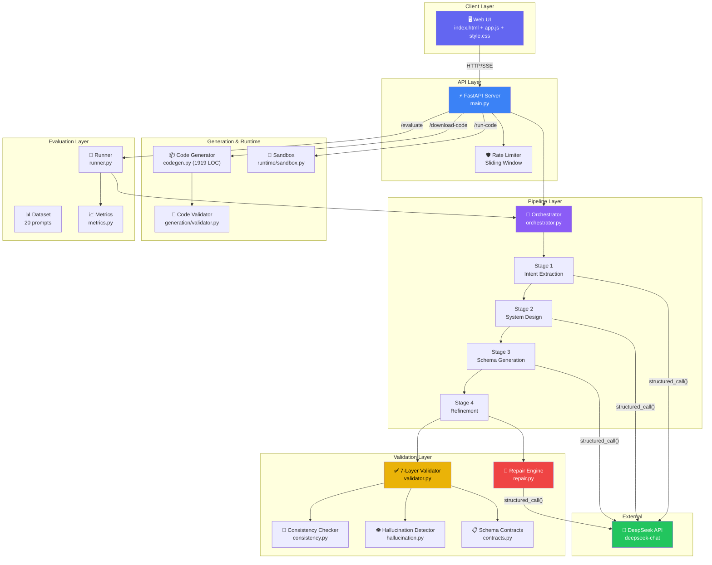
```mermaid
graph TB
    subgraph "Client Layer"
        UI["🖥️ Web UI<br/>index.html + app.js + style.css"]
    end

    subgraph "API Layer"
        API["⚡ FastAPI Server<br/>main.py"]
        RL["🛡️ Rate Limiter<br/>Sliding Window"]
    end

    subgraph "Pipeline Layer"
        ORCH["🎯 Orchestrator<br/>orchestrator.py"]
        S1["Stage 1<br/>Intent Extraction"]
        S2["Stage 2<br/>System Design"]
        S3["Stage 3<br/>Schema Generation"]
        S4["Stage 4<br/>Refinement"]
    end

    subgraph "Validation Layer"
        VAL["✅ 7-Layer Validator<br/>validator.py"]
        CON["🔗 Consistency Checker<br/>consistency.py"]
        HAL["👁️ Hallucination Detector<br/>hallucination.py"]
        REP["🔧 Repair Engine<br/>repair.py"]
        SCH["📋 Schema Contracts<br/>contracts.py"]
    end

    subgraph "Generation & Runtime"
        CG["📦 Code Generator<br/>codegen.py (1919 LOC)"]
        CV["🧪 Code Validator<br/>generation/validator.py"]
        SB["🚀 Sandbox<br/>runtime/sandbox.py"]
    end

    subgraph "Evaluation Layer"
        DS["📊 Dataset<br/>20 prompts"]
        RUN["🏃 Runner<br/>runner.py"]
        MET["📈 Metrics<br/>metrics.py"]
    end

    subgraph "External"
        LLM["🤖 DeepSeek API<br/>deepseek-chat"]
    end

    UI -->|"HTTP/SSE"| API
    API --> RL
    API --> ORCH
    ORCH --> S1 --> S2 --> S3 --> S4
    S1 & S2 & S3 -->|"structured_call()"| LLM
    S4 --> VAL
    VAL --> CON & HAL
    VAL --> SCH
    S4 --> REP -->|"structured_call()"| LLM
    API -->|"/download-code"| CG --> CV
    API -->|"/run-code"| SB
    API -->|"/evaluate"| RUN --> MET
    RUN --> ORCH

    style UI fill:#6366f1,color:#fff
    style API fill:#3b82f6,color:#fff
    style ORCH fill:#8b5cf6,color:#fff
    style LLM fill:#22c55e,color:#fff
    style VAL fill:#eab308,color:#000
    style REP fill:#ef4444,color:#fff
```

---

## 3. Pipeline Data Flow

This shows the exact data transformations at each stage — what goes in, what comes out.

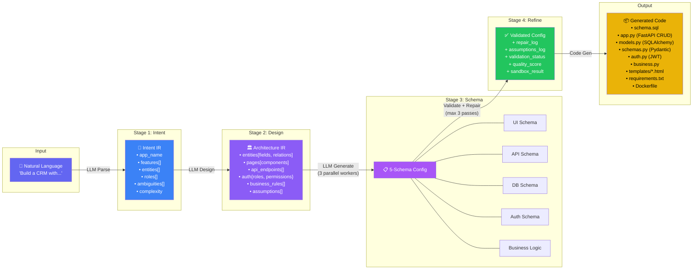
```mermaid
flowchart LR
    subgraph "Input"
        NL["📝 Natural Language<br/>'Build a CRM with...'"]
    end

    subgraph "Stage 1: Intent"
        IR1["🎯 Intent IR<br/>• app_name<br/>• features[]<br/>• entities[]<br/>• roles[]<br/>• ambiguities[]<br/>• complexity"]
    end

    subgraph "Stage 2: Design"
        IR2["🏛️ Architecture IR<br/>• entities[fields, relations]<br/>• pages[components]<br/>• api_endpoints[]<br/>• auth{roles, permissions}<br/>• business_rules[]<br/>• assumptions[]"]
    end

    subgraph "Stage 3: Schema"
        CFG["📋 5-Schema Config"]
        UI_S["UI Schema"]
        API_S["API Schema"]
        DB_S["DB Schema"]
        AUTH_S["Auth Schema"]
        BL_S["Business Logic"]
    end

    subgraph "Stage 4: Refine"
        FINAL["✅ Validated Config<br/>+ repair_log<br/>+ assumptions_log<br/>+ validation_status<br/>+ quality_score<br/>+ sandbox_result"]
    end

    subgraph "Output"
        CODE["📦 Generated Code<br/>• schema.sql<br/>• app.py (FastAPI CRUD)<br/>• models.py (SQLAlchemy)<br/>• schemas.py (Pydantic)<br/>• auth.py (JWT)<br/>• business.py<br/>• templates/*.html<br/>• requirements.txt<br/>• Dockerfile"]
    end

    NL -->|"LLM Parse"| IR1
    IR1 -->|"LLM Design"| IR2
    IR2 -->|"LLM Generate<br/>(3 parallel workers)"| CFG
    CFG --- UI_S & API_S & DB_S & AUTH_S & BL_S
    CFG -->|"Validate + Repair<br/>(max 3 passes)"| FINAL
    FINAL -->|"Code Gen"| CODE

    style NL fill:#6366f1,color:#fff
    style IR1 fill:#3b82f6,color:#fff
    style IR2 fill:#8b5cf6,color:#fff
    style CFG fill:#a855f7,color:#fff
    style FINAL fill:#22c55e,color:#fff
    style CODE fill:#eab308,color:#000
```

### Intermediate Representation (IR) Sizes

| Stage | Output | Typical Size | Token Count |
|-------|--------|-------------|-------------|
| Stage 1 | Intent IR | 1-3 KB | 300-800 |
| Stage 2 | Architecture IR | 5-15 KB | 1,500-4,000 |
| Stage 3 | 5-Schema Config | 15-40 KB | 4,000-12,000 |
| Stage 4 | Validated Config | 16-42 KB | 4,200-13,000 |

---

## 4. Module Dependency Graph

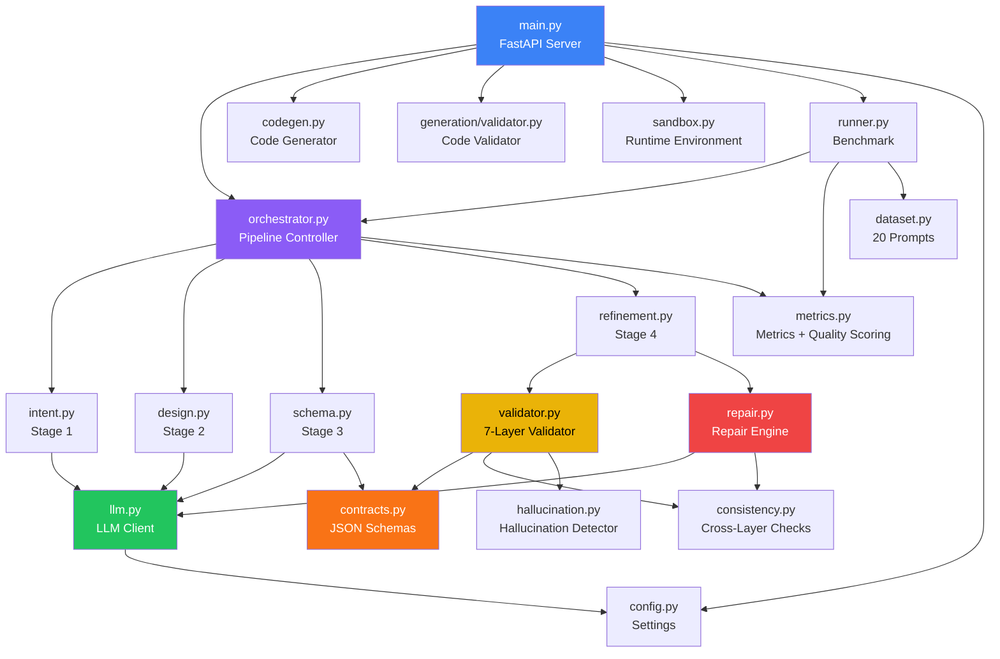
```mermaid
graph TD
    main["main.py<br/>FastAPI Server"]
    config["config.py<br/>Settings"]
    orch["orchestrator.py<br/>Pipeline Controller"]
    intent["intent.py<br/>Stage 1"]
    design["design.py<br/>Stage 2"]
    schema["schema.py<br/>Stage 3"]
    refine["refinement.py<br/>Stage 4"]
    llm["llm.py<br/>LLM Client"]
    
    validator["validator.py<br/>7-Layer Validator"]
    contracts["contracts.py<br/>JSON Schemas"]
    consistency["consistency.py<br/>Cross-Layer Checks"]
    halluc["hallucination.py<br/>Hallucination Detector"]
    repair["repair.py<br/>Repair Engine"]
    
    codegen["codegen.py<br/>Code Generator"]
    codeval["generation/validator.py<br/>Code Validator"]
    sandbox["sandbox.py<br/>Runtime Environment"]
    
    runner["runner.py<br/>Benchmark"]
    metrics["metrics.py<br/>Metrics + Quality Scoring"]
    dataset["dataset.py<br/>20 Prompts"]
    
    main --> orch & codegen & codeval & sandbox & runner
    main --> config
    orch --> intent & design & schema & refine
    orch --> metrics
    intent & design --> llm
    schema --> llm & contracts
    refine --> validator & repair
    validator --> contracts & consistency & halluc
    repair --> llm & consistency
    runner --> orch & metrics & dataset
    llm --> config
    
    style main fill:#3b82f6,color:#fff
    style orch fill:#8b5cf6,color:#fff
    style llm fill:#22c55e,color:#fff
    style validator fill:#eab308,color:#000
    style repair fill:#ef4444,color:#fff
    style contracts fill:#f97316,color:#fff
```

---

## 5. Sequence Diagrams

### 5.1 Full Pipeline Flow (SSE Streaming)

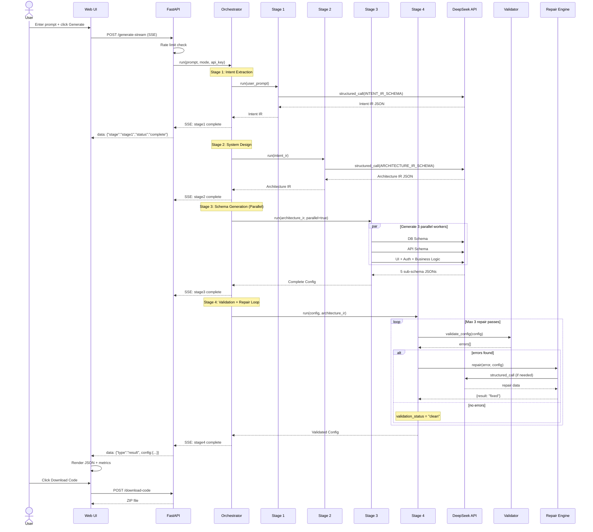
```mermaid
sequenceDiagram
    actor User
    participant UI as Web UI
    participant API as FastAPI
    participant Orch as Orchestrator
    participant S1 as Stage 1
    participant S2 as Stage 2
    participant S3 as Stage 3
    participant S4 as Stage 4
    participant LLM as DeepSeek API
    participant Val as Validator
    participant Rep as Repair Engine

    User->>UI: Enter prompt + click Generate
    UI->>API: POST /generate-stream (SSE)
    API->>API: Rate limit check
    API->>Orch: run(prompt, mode, api_key)
    
    Note over Orch: Stage 1: Intent Extraction
    Orch->>S1: run(user_prompt)
    S1->>LLM: structured_call(INTENT_IR_SCHEMA)
    LLM-->>S1: Intent IR JSON
    S1-->>Orch: Intent IR
    Orch-->>API: SSE: stage1 complete
    API-->>UI: data: {"stage":"stage1","status":"complete"}
    
    Note over Orch: Stage 2: System Design
    Orch->>S2: run(intent_ir)
    S2->>LLM: structured_call(ARCHITECTURE_IR_SCHEMA)
    LLM-->>S2: Architecture IR JSON
    S2-->>Orch: Architecture IR
    Orch-->>API: SSE: stage2 complete
    
    Note over Orch: Stage 3: Schema Generation (Parallel)
    Orch->>S3: run(architecture_ir, parallel=true)
    par Generate 3 parallel workers
        S3->>LLM: DB Schema
        S3->>LLM: API Schema
        S3->>LLM: UI + Auth + Business Logic
    end
    LLM-->>S3: 5 sub-schema JSONs
    S3-->>Orch: Complete Config
    Orch-->>API: SSE: stage3 complete
    
    Note over Orch: Stage 4: Validation + Repair Loop
    Orch->>S4: run(config, architecture_ir)
    loop Max 3 repair passes
        S4->>Val: validate_config(config)
        Val-->>S4: errors[]
        alt errors found
            S4->>Rep: repair(error, config)
            Rep->>LLM: structured_call (if needed)
            LLM-->>Rep: repair data
            Rep-->>S4: {result: "fixed"}
        else no errors
            Note over S4: validation_status = "clean"
        end
    end
    S4-->>Orch: Validated Config
    Orch-->>API: SSE: stage4 complete
    
    API-->>UI: data: {"type":"result", config:{...}}
    UI->>UI: Render JSON + metrics
    User->>UI: Click Download Code
    UI->>API: POST /download-code
    API-->>UI: ZIP file
```

### 5.2 Repair Loop Detail

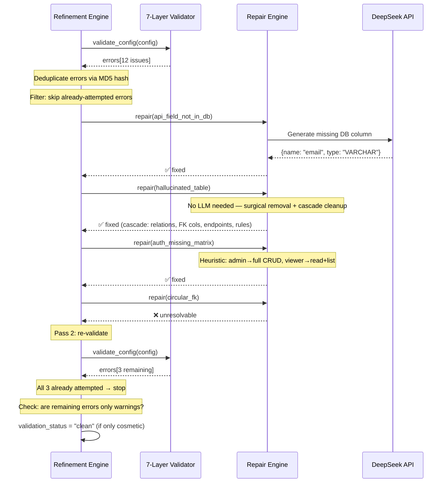
```mermaid
sequenceDiagram
    participant R as Refinement Engine
    participant V as 7-Layer Validator
    participant RE as Repair Engine
    participant LLM as DeepSeek API

    R->>V: validate_config(config)
    V-->>R: errors[12 issues]
    
    Note over R: Deduplicate errors via MD5 hash
    Note over R: Filter: skip already-attempted errors
    
    R->>RE: repair(api_field_not_in_db)
    RE->>LLM: Generate missing DB column
    LLM-->>RE: {name: "email", type: "VARCHAR"}
    RE-->>R: ✅ fixed

    R->>RE: repair(hallucinated_table)
    Note over RE: No LLM needed — surgical removal + cascade cleanup
    RE-->>R: ✅ fixed (cascade: relations, FK cols, endpoints, rules)

    R->>RE: repair(auth_missing_matrix)
    Note over RE: Heuristic: admin→full CRUD, viewer→read+list
    RE-->>R: ✅ fixed

    R->>RE: repair(circular_fk)
    RE-->>R: ❌ unresolvable

    Note over R: Pass 2: re-validate
    R->>V: validate_config(config)
    V-->>R: errors[3 remaining]
    Note over R: All 3 already attempted → stop
    Note over R: Check: are remaining errors only warnings?
    R->>R: validation_status = "clean" (if only cosmetic)
```

---

## 6. State Machine Diagrams

### 6.1 Pipeline State Machine

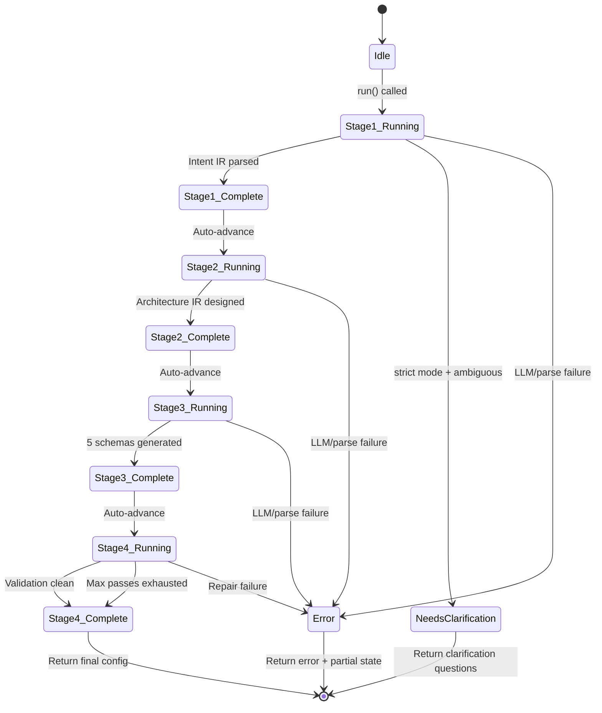
```mermaid
stateDiagram-v2
    [*] --> Idle
    
    Idle --> Stage1_Running: run() called
    
    Stage1_Running --> Stage1_Complete: Intent IR parsed
    Stage1_Running --> NeedsClarification: strict mode + ambiguous
    Stage1_Running --> Error: LLM/parse failure
    
    NeedsClarification --> [*]: Return clarification questions
    
    Stage1_Complete --> Stage2_Running: Auto-advance
    Stage2_Running --> Stage2_Complete: Architecture IR designed
    Stage2_Running --> Error: LLM/parse failure
    
    Stage2_Complete --> Stage3_Running: Auto-advance
    Stage3_Running --> Stage3_Complete: 5 schemas generated
    Stage3_Running --> Error: LLM/parse failure
    
    Stage3_Complete --> Stage4_Running: Auto-advance
    Stage4_Running --> Stage4_Complete: Validation clean
    Stage4_Running --> Stage4_Complete: Max passes exhausted
    Stage4_Running --> Error: Repair failure
    
    Stage4_Complete --> [*]: Return final config
    Error --> [*]: Return error + partial state
```

### 6.2 Validation Status State Machine

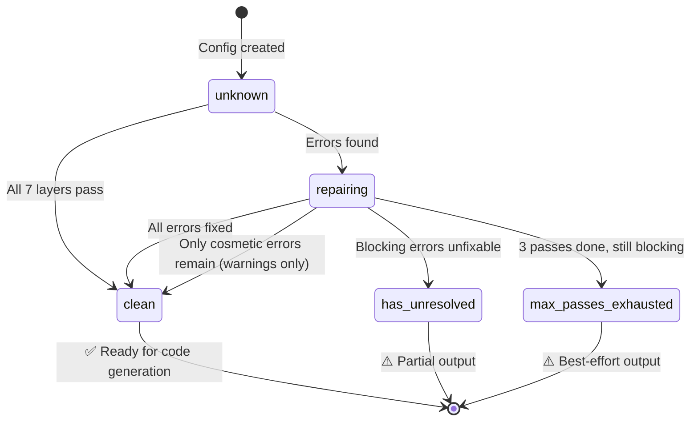
```mermaid
stateDiagram-v2
    [*] --> unknown: Config created
    
    unknown --> clean: All 7 layers pass
    unknown --> repairing: Errors found
    
    repairing --> clean: All errors fixed
    repairing --> clean: Only cosmetic errors remain (warnings only)
    repairing --> has_unresolved: Blocking errors unfixable
    repairing --> max_passes_exhausted: 3 passes done, still blocking
    
    clean --> [*]: ✅ Ready for code generation
    has_unresolved --> [*]: ⚠️ Partial output
    max_passes_exhausted --> [*]: ⚠️ Best-effort output
```

### 6.3 Repair Engine Decision Tree

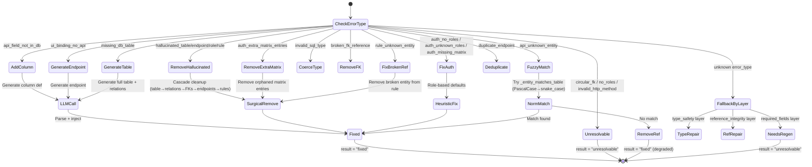
```mermaid
stateDiagram-v2
    [*] --> CheckErrorType

    CheckErrorType --> AddColumn: api_field_not_in_db
    CheckErrorType --> GenerateEndpoint: ui_binding_no_api
    CheckErrorType --> RemoveHallucinated: hallucinated_table/endpoint/role/rule
    CheckErrorType --> FixAuth: auth_no_roles / auth_unknown_roles / auth_missing_matrix
    CheckErrorType --> RemoveExtraMatrix: auth_extra_matrix_entries
    CheckErrorType --> CoerceType: invalid_sql_type
    CheckErrorType --> RemoveFK: broken_fk_reference
    CheckErrorType --> GenerateTable: missing_db_table
    CheckErrorType --> FuzzyMatch: api_unknown_entity
    CheckErrorType --> Deduplicate: duplicate_endpoint
    CheckErrorType --> FixBrokenRef: rule_unknown_entity
    CheckErrorType --> Unresolvable: circular_fk / no_roles / invalid_http_method
    CheckErrorType --> FallbackByLayer: unknown error_type

    AddColumn --> LLMCall: Generate column def
    GenerateEndpoint --> LLMCall: Generate endpoint
    GenerateTable --> LLMCall: Generate full table + relations
    RemoveHallucinated --> SurgicalRemove: Cascade cleanup (table→relations→FKs→endpoints→rules)
    FixAuth --> HeuristicFix: Role-based defaults
    RemoveExtraMatrix --> SurgicalRemove: Remove orphaned matrix entries
    FuzzyMatch --> NormMatch: Try _entity_matches_table (PascalCase→snake_case)
    FixBrokenRef --> SurgicalRemove: Remove broken entity from rule
    
    LLMCall --> Fixed: Parse + inject
    SurgicalRemove --> Fixed
    HeuristicFix --> Fixed
    NormMatch --> Fixed: Match found
    NormMatch --> RemoveRef: No match
    FallbackByLayer --> TypeRepair: type_safety layer
    FallbackByLayer --> RefRepair: reference_integrity layer
    FallbackByLayer --> NeedsRegen: required_fields layer
    
    Fixed --> [*]: result = "fixed"
    Unresolvable --> [*]: result = "unresolvable"
    RemoveRef --> [*]: result = "fixed" (degraded)
    NeedsRegen --> [*]: result = "unresolvable"
```

---

## 7. Class Diagrams

### 7.1 Core Classes

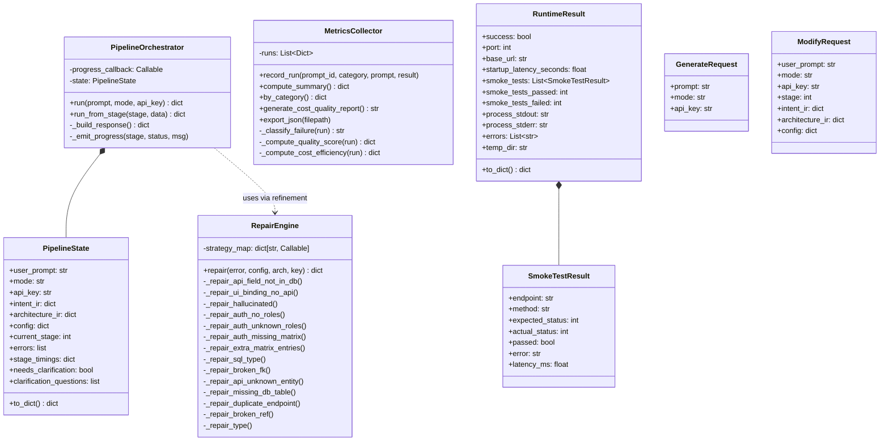
```mermaid
classDiagram
    class PipelineOrchestrator {
        -progress_callback: Callable
        -state: PipelineState
        +run(prompt, mode, api_key) dict
        +run_from_stage(stage, data) dict
        -_build_response() dict
        -_emit_progress(stage, status, msg)
    }
    
    class PipelineState {
        +user_prompt: str
        +mode: str
        +api_key: str
        +intent_ir: dict
        +architecture_ir: dict
        +config: dict
        +current_stage: int
        +errors: list
        +stage_timings: dict
        +needs_clarification: bool
        +clarification_questions: list
        +to_dict() dict
    }
    
    class RepairEngine {
        +repair(error, config, arch, key) dict
        -strategy_map: dict[str, Callable]
        -_repair_api_field_not_in_db()
        -_repair_ui_binding_no_api()
        -_repair_hallucinated()
        -_repair_auth_no_roles()
        -_repair_auth_unknown_roles()
        -_repair_auth_missing_matrix()
        -_repair_extra_matrix_entries()
        -_repair_sql_type()
        -_repair_broken_fk()
        -_repair_api_unknown_entity()
        -_repair_missing_db_table()
        -_repair_duplicate_endpoint()
        -_repair_broken_ref()
        -_repair_type()
    }
    
    class MetricsCollector {
        -runs: List~Dict~
        +record_run(prompt_id, category, prompt, result)
        +compute_summary() dict
        +by_category() dict
        +generate_cost_quality_report() str
        +export_json(filepath)
        -_classify_failure(run) str
        -_compute_quality_score(run) dict
        -_compute_cost_efficiency(run) dict
    }
    
    class RuntimeResult {
        +success: bool
        +port: int
        +base_url: str
        +startup_latency_seconds: float
        +smoke_tests: List~SmokeTestResult~
        +smoke_tests_passed: int
        +smoke_tests_failed: int
        +process_stdout: str
        +process_stderr: str
        +errors: List~str~
        +temp_dir: str
        +to_dict() dict
    }
    
    class SmokeTestResult {
        +endpoint: str
        +method: str
        +expected_status: int
        +actual_status: int
        +passed: bool
        +error: str
        +latency_ms: float
    }
    
    class GenerateRequest {
        +prompt: str
        +mode: str
        +api_key: str
    }
    
    class ModifyRequest {
        +user_prompt: str
        +mode: str
        +api_key: str
        +stage: int
        +intent_ir: dict
        +architecture_ir: dict
        +config: dict
    }
    
    PipelineOrchestrator *-- PipelineState
    PipelineOrchestrator ..> RepairEngine : uses via refinement
    RuntimeResult *-- SmokeTestResult
```

---

## 8. Component Architecture

### 8.1 Package/Module Map

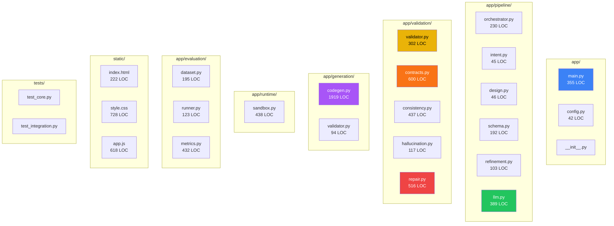
```mermaid
graph TB
    subgraph "app/"
        main["main.py<br/>355 LOC"]
        config["config.py<br/>42 LOC"]
        init["__init__.py"]
    end

    subgraph "app/pipeline/"
        orch["orchestrator.py<br/>230 LOC"]
        intent["intent.py<br/>45 LOC"]
        design["design.py<br/>46 LOC"]
        schema_mod["schema.py<br/>192 LOC"]
        refine["refinement.py<br/>103 LOC"]
        llm["llm.py<br/>389 LOC"]
    end

    subgraph "app/validation/"
        validator["validator.py<br/>302 LOC"]
        contracts["contracts.py<br/>600 LOC"]
        consistency["consistency.py<br/>437 LOC"]
        hallucination["hallucination.py<br/>117 LOC"]
        repair["repair.py<br/>516 LOC"]
    end

    subgraph "app/generation/"
        codegen["codegen.py<br/>1919 LOC"]
        codeval["validator.py<br/>94 LOC"]
    end

    subgraph "app/runtime/"
        sandbox["sandbox.py<br/>438 LOC"]
    end

    subgraph "app/evaluation/"
        dataset["dataset.py<br/>195 LOC"]
        runner["runner.py<br/>123 LOC"]
        metrics["metrics.py<br/>432 LOC"]
    end

    subgraph "static/"
        html["index.html<br/>222 LOC"]
        css["style.css<br/>728 LOC"]
        js["app.js<br/>618 LOC"]
    end

    subgraph "tests/"
        test_core["test_core.py"]
        test_int["test_integration.py"]
    end

    style main fill:#3b82f6,color:#fff
    style llm fill:#22c55e,color:#fff
    style contracts fill:#f97316,color:#fff
    style repair fill:#ef4444,color:#fff
    style validator fill:#eab308,color:#000
    style codegen fill:#a855f7,color:#fff
```

### 8.2 Lines of Code Distribution

| Package | Files | LOC | % of Total |
|---------|-------|-----|------------|
| `app/pipeline/` | 7 | 1,005 | 12.3% |
| `app/validation/` | 5 | 1,972 | 24.2% |
| `app/generation/` | 2 | 2,013 | 24.7% |
| `app/evaluation/` | 3 | 750 | 9.2% |
| `app/runtime/` | 2 | 438 | 5.4% |
| `app/` (root) | 3 | 397 | 4.9% |
| `static/` | 3 | 1,568 | 19.2% |
| **Total** | **25** | **~8,143** | **100%** |

> The **code generator (`codegen.py` at 1,919 LOC) is the single largest file**, followed by the **validation subsystem** (`contracts.py` + `repair.py` + `consistency.py` + `validator.py` = 1,855 LOC). Together, generation and validation account for ~49% of the codebase, reflecting the system's emphasis on comprehensive code output and correctness.

---

## 9. Validation Engine Architecture

### 9.1 Seven Validation Layers

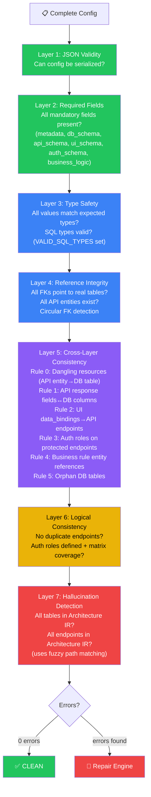
```mermaid
flowchart TB
    CONFIG["📋 Complete Config"]
    
    CONFIG --> L1["Layer 1: JSON Validity<br/>Can config be serialized?"]
    L1 --> L2["Layer 2: Required Fields<br/>All mandatory fields present?<br/>(metadata, db_schema, api_schema, ui_schema, auth_schema, business_logic)"]
    L2 --> L3["Layer 3: Type Safety<br/>All values match expected types?<br/>SQL types valid? (VALID_SQL_TYPES set)"]
    L3 --> L4["Layer 4: Reference Integrity<br/>All FKs point to real tables?<br/>All API entities exist?<br/>Circular FK detection"]
    L4 --> L5["Layer 5: Cross-Layer Consistency<br/>Rule 0: Dangling resources (API entity→DB table)<br/>Rule 1: API response fields↔DB columns<br/>Rule 2: UI data_bindings→API endpoints<br/>Rule 3: Auth roles on protected endpoints<br/>Rule 4: Business rule entity references<br/>Rule 5: Orphan DB tables"]
    L5 --> L6["Layer 6: Logical Consistency<br/>No duplicate endpoints?<br/>Auth roles defined + matrix coverage?"]
    L6 --> L7["Layer 7: Hallucination Detection<br/>All tables in Architecture IR?<br/>All endpoints in Architecture IR?<br/>(uses fuzzy path matching)"]
    
    L7 --> RESULT{"Errors?"}
    RESULT -->|"0 errors"| CLEAN["✅ CLEAN"]
    RESULT -->|"errors found"| REPAIR["🔧 Repair Engine"]
    
    style L1 fill:#22c55e,color:#fff
    style L2 fill:#22c55e,color:#fff
    style L3 fill:#3b82f6,color:#fff
    style L4 fill:#3b82f6,color:#fff
    style L5 fill:#8b5cf6,color:#fff
    style L6 fill:#eab308,color:#000
    style L7 fill:#ef4444,color:#fff
    style CLEAN fill:#22c55e,color:#fff
    style REPAIR fill:#ef4444,color:#fff
```

### 9.2 Cross-Layer Consistency Checks (Layer 5 — `consistency.py`)

The consistency checker implements 6 rules with advanced name normalization:

- **`_camel_to_snake()`**: Converts `CartItem` → `cart_item` for cross-layer matching
- **`_entity_matches_table()`** / **`_entity_matches_any_table()`**: Handles singular/plural (`categories` ↔ `category`), PascalCase→snake_case, and prefix matching
- **`NON_TABLE_PATH_SEGMENTS`**: Frozenset of 26 path segments that are actions, not resources (e.g., `login`, `search`, `dashboard`)
- **`action_verbs`**: Set of 30+ verbs excluded from resource checks for non-GET endpoints

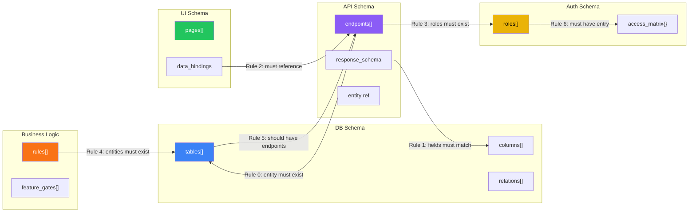
```mermaid
graph LR
    subgraph "DB Schema"
        T1["tables[]"]
        C1["columns[]"]
        R1["relations[]"]
    end

    subgraph "API Schema"
        E1["endpoints[]"]
        RS["response_schema"]
        EN["entity ref"]
    end

    subgraph "UI Schema"
        P1["pages[]"]
        DB["data_bindings"]
    end

    subgraph "Auth Schema"
        RO["roles[]"]
        AM["access_matrix{}"]
    end

    subgraph "Business Logic"
        BR["rules[]"]
        FG["feature_gates[]"]
    end

    E1 -->|"Rule 0: entity must exist"| T1
    RS -->|"Rule 1: fields must match"| C1
    DB -->|"Rule 2: must reference"| E1
    E1 -->|"Rule 3: roles must exist"| RO
    RO -->|"Rule 6: must have entry"| AM
    BR -->|"Rule 4: entities must exist"| T1
    T1 -->|"Rule 5: should have endpoints"| E1

    style T1 fill:#3b82f6,color:#fff
    style E1 fill:#8b5cf6,color:#fff
    style P1 fill:#22c55e,color:#fff
    style RO fill:#eab308,color:#000
    style BR fill:#f97316,color:#fff
```

---

## 10. Repair Engine Strategy Pattern

The `RepairEngine` class (in `repair.py`) uses a **strategy map** pattern. Each error type dispatches to a specific handler. Handlers are categorized by whether they require LLM calls:

### LLM-Required Repairs (3)
- `api_field_not_in_db` → Calls LLM to generate a DB column definition matching `FIELD_SCHEMA`
- `ui_binding_no_api` → Calls LLM to generate a full API endpoint matching `API_ENDPOINT_SCHEMA`
- `missing_db_table` → Calls LLM to generate complete table with columns + relations from Architecture IR entity

### Local/Heuristic Repairs (11)
- `hallucinated_table` → Cascade removal: table → relations → FK columns → API endpoints → business rules
- `hallucinated_endpoint` → Direct endpoint removal
- `hallucinated_role` → Role removal + access_matrix cleanup
- `hallucinated_rule` → Rule removal
- `auth_no_roles` → Assigns all defined roles (or `["user"]` default) to unprotected endpoint
- `auth_unknown_roles` → Creates missing roles with `read` default permissions
- `auth_missing_matrix` → Generates matrix entries with role-aware heuristics (`admin`→full CRUD, `viewer`→read+list)
- `auth_extra_matrix_entries` → Removes orphaned matrix entries
- `invalid_sql_type` / `type_safety` → Coerces to `VARCHAR`
- `broken_fk_reference` → Removes FK annotation
- `api_unknown_entity` → Fuzzy match via `_entity_matches_table()`, fallback: remove entity ref
- `duplicate_endpoint` → Deduplicates by `(method, path)` key, keeps first occurrence
- `rule_unknown_entity` → Removes broken entity from rule's `entities_involved[]`

### Unresolvable (3)
- `circular_fk` → Needs schema redesign
- `no_roles_defined` → Needs regeneration
- `invalid_http_method` → Needs regeneration


```mermaid
graph TD
    ERR["Validation Error"]
    
    ERR --> DISPATCH{"error_type?"}
    
    DISPATCH --> S1["api_field_not_in_db<br/>→ LLM generates column"]
    DISPATCH --> S2["ui_binding_no_api<br/>→ LLM generates endpoint"]
    DISPATCH --> S3["hallucinated_table<br/>→ Remove + cascade cleanup"]
    DISPATCH --> S4["hallucinated_endpoint<br/>→ Remove endpoint"]
    DISPATCH --> S5["auth_no_roles<br/>→ Assign default roles"]
    DISPATCH --> S6["auth_unknown_roles<br/>→ Create missing roles"]
    DISPATCH --> S7["auth_missing_matrix<br/>→ Generate matrix entries"]
    DISPATCH --> S8["invalid_sql_type<br/>→ Coerce to VARCHAR"]
    DISPATCH --> S9["broken_fk_reference<br/>→ Remove FK"]
    DISPATCH --> S10["missing_db_table<br/>→ LLM generates table + relations"]
    DISPATCH --> S11["api_unknown_entity<br/>→ Fuzzy match or remove"]
    DISPATCH --> S12["duplicate_endpoint<br/>→ Deduplicate"]
    DISPATCH --> S13["auth_extra_matrix_entries<br/>→ Remove orphaned entries"]
    DISPATCH --> S14["circular_fk<br/>→ Unresolvable"]
    DISPATCH --> S15["Fallback by layer"]

    S1 & S2 & S10 --> LLM_CALL["🤖 LLM Call<br/>structured_call()"]
    S3 & S4 & S5 & S6 & S7 & S8 & S9 & S11 & S12 & S13 --> LOCAL["⚡ Local Fix<br/>No LLM needed"]
    S14 --> SKIP["⏭️ Skip<br/>Needs redesign"]

    LLM_CALL --> FIXED["✅ Fixed"]
    LOCAL --> FIXED
    SKIP --> UNRESOLVABLE["❌ Unresolvable"]

    style ERR fill:#ef4444,color:#fff
    style FIXED fill:#22c55e,color:#fff
    style UNRESOLVABLE fill:#6b7280,color:#fff
    style LLM_CALL fill:#8b5cf6,color:#fff
```

---

## 11. Data Schema Contracts (ERD)

### 11.1 Intent IR Schema

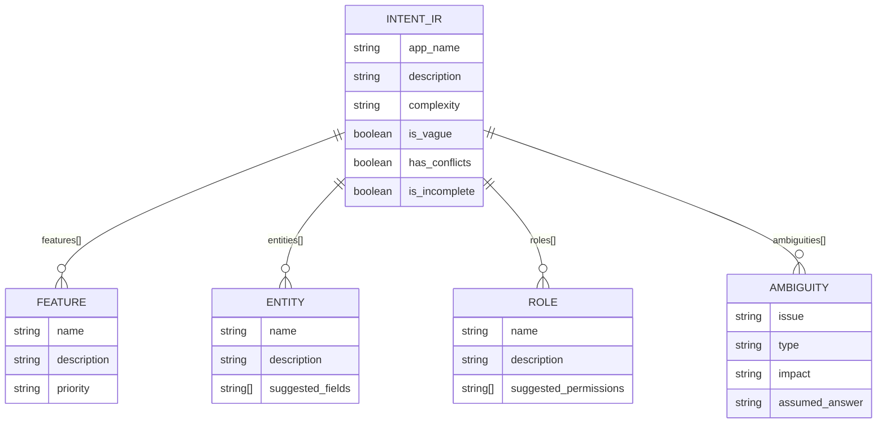
```mermaid
erDiagram
    INTENT_IR {
        string app_name
        string description
        string complexity
        boolean is_vague
        boolean has_conflicts
        boolean is_incomplete
    }
    
    FEATURE {
        string name
        string description
        string priority
    }
    
    ENTITY {
        string name
        string description
        string[] suggested_fields
    }
    
    ROLE {
        string name
        string description
        string[] suggested_permissions
    }
    
    AMBIGUITY {
        string issue
        string type
        string impact
        string assumed_answer
    }
    
    INTENT_IR ||--o{ FEATURE : "features[]"
    INTENT_IR ||--o{ ENTITY : "entities[]"
    INTENT_IR ||--o{ ROLE : "roles[]"
    INTENT_IR ||--o{ AMBIGUITY : "ambiguities[]"
```

### 11.2 Architecture IR Schema

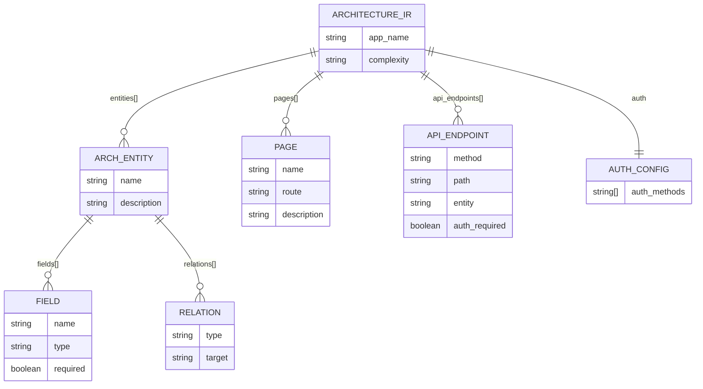
```mermaid
erDiagram
    ARCHITECTURE_IR {
        string app_name
        string complexity
    }
    
    ARCH_ENTITY {
        string name
        string description
    }
    
    FIELD {
        string name
        string type
        boolean required
    }
    
    RELATION {
        string type
        string target
    }
    
    PAGE {
        string name
        string route
        string description
    }
    
    API_ENDPOINT {
        string method
        string path
        string entity
        boolean auth_required
    }
    
    AUTH_CONFIG {
        string[] auth_methods
    }
    
    ARCHITECTURE_IR ||--o{ ARCH_ENTITY : "entities[]"
    ARCH_ENTITY ||--o{ FIELD : "fields[]"
    ARCH_ENTITY ||--o{ RELATION : "relations[]"
    ARCHITECTURE_IR ||--o{ PAGE : "pages[]"
    ARCHITECTURE_IR ||--o{ API_ENDPOINT : "api_endpoints[]"
    ARCHITECTURE_IR ||--|| AUTH_CONFIG : "auth"
```

### 11.3 Complete Config Schema

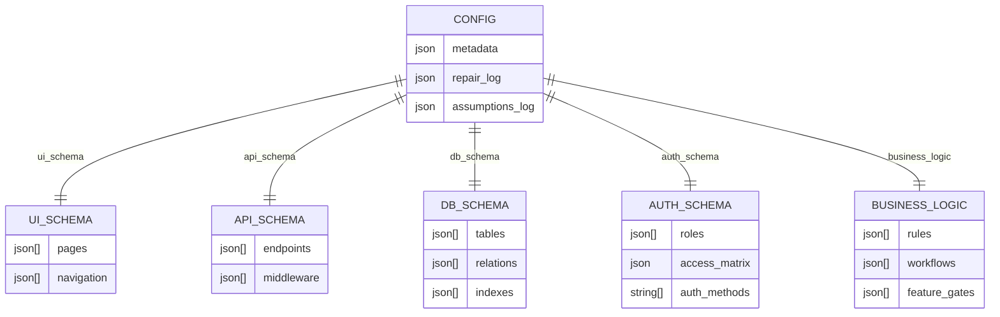
```mermaid
erDiagram
    CONFIG {
        json metadata
        json repair_log
        json assumptions_log
    }
    
    UI_SCHEMA {
        json[] pages
        json[] navigation
    }
    
    API_SCHEMA {
        json[] endpoints
        json[] middleware
    }
    
    DB_SCHEMA {
        json[] tables
        json[] relations
        json[] indexes
    }
    
    AUTH_SCHEMA {
        json[] roles
        json access_matrix
        string[] auth_methods
    }
    
    BUSINESS_LOGIC {
        json[] rules
        json[] workflows
        json[] feature_gates
    }
    
    CONFIG ||--|| UI_SCHEMA : "ui_schema"
    CONFIG ||--|| API_SCHEMA : "api_schema"
    CONFIG ||--|| DB_SCHEMA : "db_schema"
    CONFIG ||--|| AUTH_SCHEMA : "auth_schema"
    CONFIG ||--|| BUSINESS_LOGIC : "business_logic"
```

---

## 12. Concurrency Model

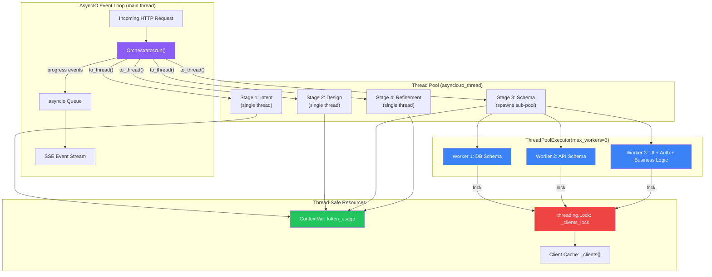
```mermaid
graph TB
    subgraph "AsyncIO Event Loop (main thread)"
        REQ["Incoming HTTP Request"]
        ORCH["Orchestrator.run()"]
        SSE["SSE Event Stream"]
        QUEUE["asyncio.Queue"]
    end
    
    subgraph "Thread Pool (asyncio.to_thread)"
        S1["Stage 1: Intent<br/>(single thread)"]
        S2["Stage 2: Design<br/>(single thread)"]
        S3_MAIN["Stage 3: Schema<br/>(spawns sub-pool)"]
        S4["Stage 4: Refinement<br/>(single thread)"]
    end
    
    subgraph "ThreadPoolExecutor(max_workers=3)"
        W1["Worker 1: DB Schema"]
        W2["Worker 2: API Schema"]
        W3["Worker 3: UI + Auth + Business Logic"]
    end
    
    subgraph "Thread-Safe Resources"
        CTX["ContextVar: token_usage"]
        LOCK["threading.Lock: _clients_lock"]
        CACHE["Client Cache: _clients{}"]
    end
    
    REQ --> ORCH
    ORCH -->|"to_thread()"| S1
    ORCH -->|"to_thread()"| S2
    ORCH -->|"to_thread()"| S3_MAIN
    ORCH -->|"to_thread()"| S4
    
    S3_MAIN --> W1 & W2 & W3
    
    ORCH -->|"progress events"| QUEUE --> SSE
    
    W1 & W2 & W3 -->|"lock"| LOCK --> CACHE
    S1 & S2 & S3_MAIN & S4 --> CTX
    
    style ORCH fill:#8b5cf6,color:#fff
    style LOCK fill:#ef4444,color:#fff
    style CTX fill:#22c55e,color:#fff
    style W1 fill:#3b82f6,color:#fff
    style W2 fill:#3b82f6,color:#fff
    style W3 fill:#3b82f6,color:#fff
```

### Concurrency Mechanisms

| Mechanism | Where | Purpose |
|-----------|-------|---------|
| `asyncio.to_thread()` | Orchestrator → each stage | Non-blocking LLM calls |
| `ThreadPoolExecutor(3)` | Stage 3: `_generate_subschemas()` | 3 parallel LLM calls for sub-schema generation |
| `threading.Lock` | `_clients` cache in `llm.py` | Thread-safe OpenAI client reuse |
| `contextvars.ContextVar` | `_token_usage` in `llm.py` | Request-isolated token counters |
| `asyncio.Queue` | SSE streaming in `orchestrator.py` | Progress event delivery to frontend |
| `asyncio.Lock` | Rate limiter in `main.py` | Async-safe sliding window bucket access |

### Stage 3 Parallelism Detail

Stage 3 (`schema.py`) splits the Architecture IR into **5 sub-schema generation tasks** but uses only **3 workers** (`ThreadPoolExecutor(max_workers=3)`):

| Worker | Sub-schemas Generated |
|--------|----------------------|
| Worker 1 | `db_schema` (tables, columns, relations, indexes) |
| Worker 2 | `api_schema` (endpoints, middleware) |
| Worker 3 | `ui_schema` + `auth_schema` + `business_logic` (combined) |

Each sub-schema uses its own contract from `contracts.py` for validation. Results are merged via `_merge_results()` with a `_normalize_json()` cleanup pass.

---

## 13. API Endpoint Map

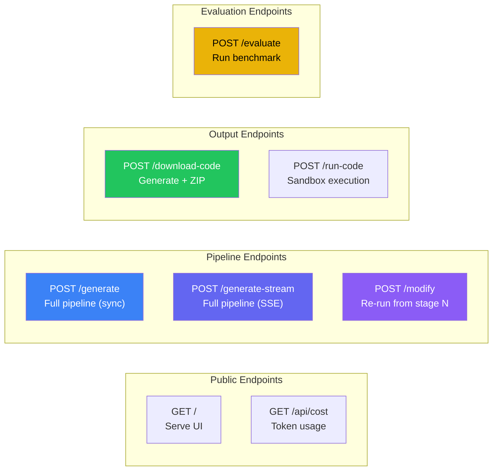
```mermaid
graph LR
    subgraph "Public Endpoints"
        GET_ROOT["GET /<br/>Serve UI"]
        GET_COST["GET /api/cost<br/>Token usage"]
    end

    subgraph "Pipeline Endpoints"
        POST_GEN["POST /generate<br/>Full pipeline (sync)"]
        POST_SSE["POST /generate-stream<br/>Full pipeline (SSE)"]
        POST_MOD["POST /modify<br/>Re-run from stage N"]
    end

    subgraph "Output Endpoints"
        POST_DL["POST /download-code<br/>Generate + ZIP"]
        POST_RUN["POST /run-code<br/>Sandbox execution"]
    end

    subgraph "Evaluation Endpoints"
        POST_EVAL["POST /evaluate<br/>Run benchmark"]
    end

    style POST_SSE fill:#6366f1,color:#fff
    style POST_GEN fill:#3b82f6,color:#fff
    style POST_MOD fill:#8b5cf6,color:#fff
    style POST_DL fill:#22c55e,color:#fff
    style POST_EVAL fill:#eab308,color:#000
```

| Endpoint | Method | Rate Limited | Auth | Response |
|----------|--------|-------------|------|----------|
| `/` | GET | ❌ | ❌ | HTML (serves `static/index.html`) |
| `/generate` | POST | ✅ | Optional API key | JSON |
| `/generate-stream` | POST | ✅ | Optional API key | SSE stream |
| `/modify` | POST | ✅ | Optional API key | JSON |
| `/download-code` | POST | ❌ | ❌ | ZIP file (in-memory via `io.BytesIO`) |
| `/run-code` | POST | ❌ | ❌ | JSON (sandbox result with smoke tests) |
| `/evaluate` | POST | ✅ | ❌ | JSON (benchmark results) |
| `/api/cost` | GET | ❌ | ❌ | JSON (token usage + estimated cost) |

---

## 14. Design Patterns Used

### Pattern Catalog

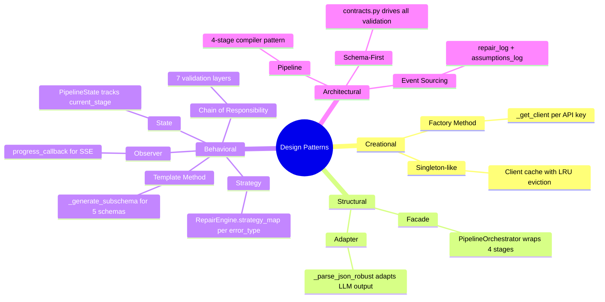
```mermaid
mindmap
    root((Design Patterns))
        Creational
            Factory Method
                _get_client per API key
            Singleton-like
                Client cache with LRU eviction
        Structural
            Facade
                PipelineOrchestrator wraps 4 stages
            Adapter
                _parse_json_robust adapts LLM output
        Behavioral
            Strategy
                RepairEngine.strategy_map per error_type
            Chain of Responsibility
                7 validation layers
            Observer
                progress_callback for SSE
            Template Method
                _generate_subschema for 5 schemas
            State
                PipelineState tracks current_stage
        Architectural
            Pipeline
                4-stage compiler pattern
            Schema-First
                contracts.py drives all validation
            Event Sourcing
                repair_log + assumptions_log
```

### Pattern Details

| Pattern | Where | Implementation |
|---------|-------|----------------|
| **Pipeline** | `orchestrator.py` | 4 sequential stages, each producing an IR |
| **Strategy** | `repair.py` | `strategy_map` dict dispatches to 17 repair handlers (14 typed + 3 lambda unresolvable) |
| **Chain of Responsibility** | `validator.py` | 7 validation layers, each adds errors independently |
| **Observer** | `orchestrator.py` | `progress_callback` notifies UI of stage transitions via `asyncio.Queue` |
| **Factory** | `llm.py` | `_get_client()` creates/caches OpenAI clients per key with `threading.Lock` |
| **Adapter** | `llm.py` | `_parse_json_robust()` 8-strategy JSON recovery from LLM output |
| **Facade** | `orchestrator.py` | Single `run()` method hides 4-stage complexity |
| **Template Method** | `schema.py` | `_generate_subschema()` called 5× with different schemas via `ThreadPoolExecutor` |
| **Null Object** | `llm.py` | `_normalize_llm_nulls()` replaces null→[] for arrays, null→{} for objects |
| **Schema-First** | `contracts.py` | 8 JSON Schemas are the source of truth for all validation |
| **Dataclass** | `sandbox.py` | `RuntimeResult` and `SmokeTestResult` as structured result containers |

---

## 15. Software Engineering Metrics

### 15.1 Quality Score System

The system computes a **composite quality score** (0-100) for each pipeline run using 6 weighted dimensions:

| Dimension | Weight | Measures |
|-----------|--------|----------|
| `schema_completeness` | 0.20 | Presence of all 6 expected config keys |
| `validation_pass_rate` | 0.25 | Clean=100, unresolved=50, max_passes=30, else=0 |
| `repair_effectiveness` | 0.15 | Clean with repairs=50+10×count, clean without=100, else=30-5×count |
| `code_executability` | 0.25 | Clean=100, unresolved=50, else=0 |
| `clarity_detection` | 0.10 | Correctly identifies vague/incomplete prompts |
| `conflict_detection` | 0.05 | Correctly flags contradictory requirements |

### 15.2 Evaluation Metrics Tracked

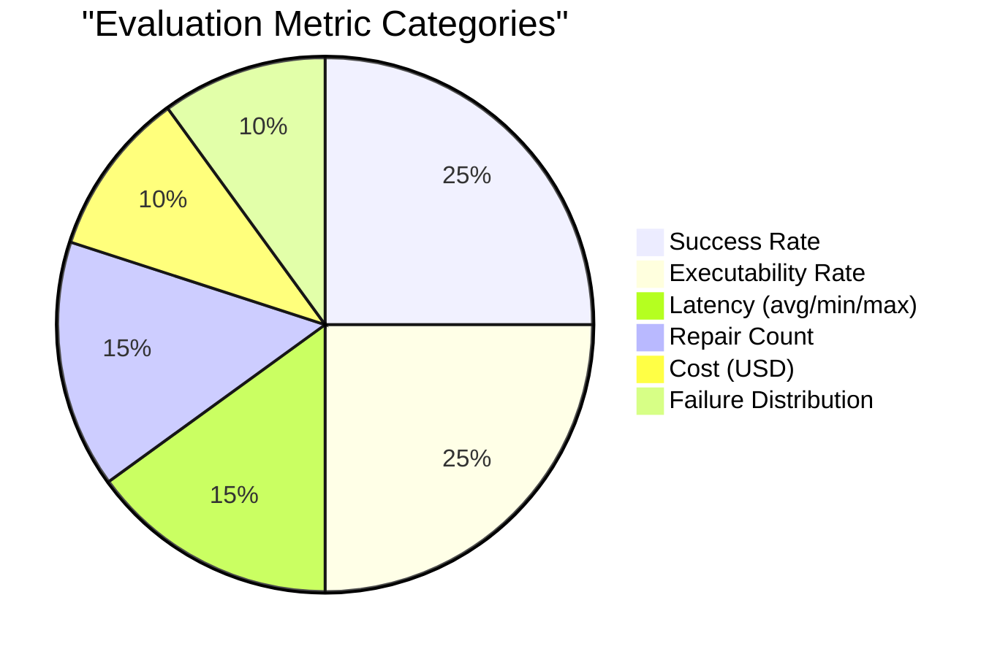
```mermaid
pie title "Evaluation Metric Categories"
    "Success Rate" : 25
    "Executability Rate" : 25
    "Latency (avg/min/max)" : 15
    "Repair Count" : 15
    "Cost (USD)" : 10
    "Failure Distribution" : 10
```

| Metric | Formula | What It Measures |
|--------|---------|-----------------| 
| **Success Rate** | `successful / total × 100` | End-to-end pipeline completion |
| **Executability Rate** | `clean_configs / total × 100` | Configs that pass all 7 validation layers |
| **Avg Latency** | `Σ(latency) / count` | Mean wall-clock time per request |
| **Avg Repairs/Request** | `Σ(repairs) / total` | Self-healing efficiency |
| **Cost per Request** | `Σ(cost) / total` | DeepSeek API cost efficiency |
| **Cost per Quality Point** | `cost / max(quality, 1)` | Cost-effectiveness |
| **Failure Distribution** | Count per failure type | Root cause categorization |

### 15.3 Failure Type Taxonomy

```mermaid
graph TD
    F["Failure"]
    F --> NC["needs_clarification<br/>Prompt too vague"]
    F --> PE["pipeline_error<br/>LLM/parse failure"]
    F --> UI["unresolvable_issues<br/>Structural problems"]
    F --> MP["max_passes_exhausted<br/>Repair loop limit"]
    F --> UK["unknown<br/>Uncategorized"]

    style NC fill:#eab308,color:#000
    style PE fill:#ef4444,color:#fff
    style UI fill:#f97316,color:#fff
    style MP fill:#8b5cf6,color:#fff
    style UK fill:#6b7280,color:#fff
```

### 15.4 Code Quality Metrics

| Metric | Value | Assessment |
|--------|-------|------------|
| **Coupling** | Low | Modules communicate via dict IRs, not direct imports |
| **Cohesion** | High | Each module has a single, clear responsibility |
| **Cyclomatic Complexity** | Medium | Highest in `codegen.py` (template generation) and `consistency.py` (6 cross-checks) |
| **Test Coverage** | Structural | `tests/test_core.py` + `tests/test_integration.py`; evaluation suite provides integration testing |
| **Schema Coverage** | 100% | Every pipeline stage has a JSON Schema contract (8 total in `contracts.py`) |
| **Error Recovery** | 17 strategies | Repair engine covers all known error types with 3 fallback paths |

---

## 16. Security Architecture

```mermaid
graph TB
    subgraph "Input Validation"
        RL["Rate Limiter<br/>5 req/60s per IP<br/>asyncio.Lock + sliding window"]
        ML["Max Prompt Length<br/>3000 chars"]
        PV["Pydantic Models<br/>Type validation"]
    end

    subgraph "API Key Handling"
        UK["User Key<br/>Per-request, never stored"]
        SK["Server Key<br/>.env file, never logged"]
        TR["Transport<br/>HTTPS to DeepSeek"]
    end

    subgraph "Output Security"
        JWT["JWT Secret<br/>env var + cryptographic random fallback<br/>(secrets.token_hex(32))"]
        SAN["Filename Sanitization<br/>ZIP download names"]
        CORS["CORS<br/>Wildcard origins, no credentials"]
    end

    subgraph "Code Gen Security"
        AST["Python AST Validation<br/>Syntax correctness"]
        SQL["SQLite Validation<br/>Single shared connection<br/>for FK resolution"]
        HTML["HTML Structure Check<br/>DOCTYPE + closing tags"]
    end

    style RL fill:#ef4444,color:#fff
    style UK fill:#22c55e,color:#fff
    style JWT fill:#eab308,color:#000
```

### Rate Limiter Implementation

The rate limiter in `main.py` uses a **sliding window** algorithm:

- **5 requests** per **60 seconds** per IP address
- Cleanup of stale entries every **300 seconds** via `asyncio.create_task()`
- Protected by `asyncio.Lock` for concurrent access safety
- Returns HTTP `429` with retry guidance

---

## 17. Error Handling Strategy

```mermaid
graph TB
    subgraph "LLM Layer (llm.py)"
        LLM_E["API errors"]
        LLM_E --> RETRY["Retry with backoff<br/>3 attempts, +0.05 temp per retry"]
        RETRY --> PARSE["JSON parse failure"]
        PARSE --> RECOVER["8-strategy recovery:<br/>1. Direct JSON parse<br/>2. Regex extract {...}<br/>3. First complete object<br/>4. Truncated JSON repair<br/>5. Progressive prefix search<br/>6. tool_calls extraction<br/>7. Content block extraction<br/>8. Fallback empty object"]
    end

    subgraph "Pipeline Layer (orchestrator.py)"
        P_E["Stage failure"]
        P_E --> CATCH["try/except in Orchestrator"]
        CATCH --> STATE["Error stored in PipelineState"]
        STATE --> PARTIAL["Return partial results<br/>+ error details + traceback"]
    end

    subgraph "Validation Layer (refinement.py)"
        V_E["Validation errors"]
        V_E --> DEDUP["Deduplicate by MD5 hash<br/>(hashlib.md5 of error message)"]
        DEDUP --> REPAIR["Dispatch to RepairEngine"]
        REPAIR --> LOG["Log to repair_log[]<br/>(error + strategy + result + detail)"]
        LOG --> REVALIDATE["Re-validate (max 3 passes)"]
    end

    subgraph "API Layer (main.py)"
        A_E["Request errors"]
        A_E --> RATE["429: Rate limit exceeded"]
        A_E --> VAL["422: Validation error (Pydantic)"]
        A_E --> INT["500: Internal (FastAPI handler)"]
    end

    style RETRY fill:#eab308,color:#000
    style RECOVER fill:#8b5cf6,color:#fff
    style REPAIR fill:#ef4444,color:#fff
```

### LLM JSON Recovery Pipeline (`_parse_json_robust`)

The `llm.py` module implements an 8-strategy cascade for recovering valid JSON from LLM output:

1. **Direct parse** — `json.loads()` on raw text
2. **Regex extract** — Find `{...}` or `[...]` blocks via regex
3. **First complete object** — Scan character-by-character for balanced braces
4. **Truncated repair** — Fix common truncation: add missing `]}` closers
5. **Progressive prefix search** — Try parsing increasingly smaller prefixes
6. **Tool call extraction** — Extract from OpenAI function_call response format
7. **Content block extraction** — Extract from markdown code blocks (````json`)
8. **Fallback empty object** — Return `{}` as last resort

---

## 18. Deployment Architecture

```mermaid
graph TB
    subgraph "Client"
        BROWSER["🌐 Browser<br/>HTML + JS + CSS"]
    end
    
    subgraph "Server (Heroku/Local)"
        UVICORN["Uvicorn<br/>ASGI Server"]
        FASTAPI["FastAPI<br/>Application"]
        STATIC["Static Files<br/>/static/"]
    end
    
    subgraph "External Services"
        DEEPSEEK["DeepSeek API<br/>api.deepseek.com"]
    end
    
    subgraph "Configuration"
        ENV[".env<br/>DEEPSEEK_API_KEY"]
        PROC["Procfile<br/>web: uvicorn app.main:app"]
        REQ["requirements.txt<br/>6 dependencies"]
    end
    
    BROWSER -->|"HTTP/SSE"| UVICORN
    UVICORN --> FASTAPI
    FASTAPI --> STATIC
    FASTAPI -->|"HTTPS"| DEEPSEEK
    ENV --> FASTAPI
    
    style BROWSER fill:#6366f1,color:#fff
    style FASTAPI fill:#3b82f6,color:#fff
    style DEEPSEEK fill:#22c55e,color:#fff
```

### Runtime Sandbox Architecture

The sandbox (`runtime/sandbox.py`) provides end-to-end executability verification:

1. **File deployment** — Writes all generated files to a `tempfile.mkdtemp()` directory
2. **Dependency install** — `pip install --target lib/ -r requirements.txt` via `asyncio.to_thread()`
3. **Database init** — Executes `schema.sql` against SQLite in-memory
4. **App launch** — Spawns `subprocess.Popen([python, app.py])` with isolated `PYTHONPATH` and `DATABASE_URL`
5. **Health check** — Polls `GET /docs` every 0.5s via `urllib.request` until 200 or timeout (default 60s)
6. **Smoke tests** — Tests up to 10 API endpoints (skipping auth routes), accepts any 2xx-4xx as pass
7. **Keep-alive** — Optionally keeps app running for `keep_alive` seconds (default 300s) for user interaction
8. **Cleanup** — `asyncio.create_task(_delayed_cleanup)` kills process and removes temp dir

### Dependencies

| Package | Version | Purpose |
|---------|---------|---------|
| `fastapi` | 0.115.6 | Web framework |
| `uvicorn` | 0.34.0 | ASGI server |
| `openai` | 1.68.0 | DeepSeek API client (OpenAI-compatible) |
| `pydantic` | ≥2.5.0 | Request/response validation |
| `python-dotenv` | 1.0.1 | Environment variables |
| `jsonschema` | 4.23.0 | Schema validation |

---

## 19. Code Generator Architecture

The code generator (`codegen.py`, 1,919 LOC) is the largest single module. It transforms a validated config into 8+ runnable files:

### Generated Files

| File | Generator Function | Description |
|------|-------------------|-------------|
| `schema.sql` | `_generate_sql()` | SQLite DDL with FK constraints + junction tables |
| `models.py` | `_generate_models()` | SQLAlchemy ORM models with relationships (belongs_to, has_many, has_one, many_to_many) |
| `app.py` | `_generate_app()` | FastAPI application with CRUD routes, seed data, server-rendered HTML pages |
| `schemas.py` | `_generate_schemas()` | Pydantic BaseModel schemas (Create/Update/Response per table) |
| `auth.py` | `_generate_auth()` | JWT authentication with role-based access control |
| `business.py` | `_generate_business_logic()` | Business rule validators with entity→action dispatch |
| `requirements.txt` | `_generate_requirements()` | Python dependencies with minimum versions |
| `Dockerfile` | `_generate_dockerfile()` | Container config (Python 3.12-slim) |
| `templates/*.html` | `_generate_page_template()` | Bootstrap-based templates with data-binding JS |

### Key Code Generation Features

- **FK derivation** (`_derive_fk_from_relations()`): Ensures FK columns exist for all relations before SQL generation
- **Entity matching** (`_match_entity_to_table()`): PascalCase→snake_case + singular/plural normalization
- **PK type inference** (`_infer_pk_type_for_entity()`): Routes use `str` params for UUID/VARCHAR PKs, `int` for INTEGER
- **Server-rendered pages** (`_build_server_page()`): Generates Python code that builds HTML inline — no templates needed
- **Seed data** (`_generate_seed_data()`): Smart column-type-aware sample data (3 rows per table)
- **CRUD operations**: List (paginated), Get, Create (with business rule validation), Update, Delete
- **UI features**: Edit forms, Toggle for boolean columns, Delete with confirmation

---

## Appendix: File Index

| File | LOC | Purpose |
|------|-----|---------|
| `app/main.py` | 355 | FastAPI server, routes, rate limiter, SSE streaming, ZIP download |
| `app/config.py` | 42 | Centralized settings (model, pricing, rate limits, repair passes) |
| `app/pipeline/orchestrator.py` | 230 | Pipeline coordinator, state management, progress callbacks |
| `app/pipeline/intent.py` | 45 | Stage 1: NL → Intent IR via `structured_call()` |
| `app/pipeline/design.py` | 46 | Stage 2: Intent IR → Architecture IR via `structured_call()` |
| `app/pipeline/schema.py` | 192 | Stage 3: Architecture IR → 5-Schema Config (3 parallel workers) |
| `app/pipeline/refinement.py` | 103 | Stage 4: Validate + Repair loop (max 3 passes, MD5 dedup) |
| `app/pipeline/llm.py` | 389 | DeepSeek client, 8-strategy JSON recovery, token tracking |
| `app/validation/contracts.py` | 600 | 8 JSON Schema contracts (Intent IR, Architecture IR, 5 sub-schemas, Config) |
| `app/validation/validator.py` | 302 | 7-layer validation engine |
| `app/validation/consistency.py` | 437 | Cross-layer consistency: 6 rules, name normalization, dangling resource detection |
| `app/validation/hallucination.py` | 117 | Hallucination detector: fuzzy path matching, singularization |
| `app/validation/repair.py` | 516 | 17-strategy repair engine (3 LLM, 11 local, 3 unresolvable) |
| `app/generation/codegen.py` | 1,919 | Full-stack code generator: SQL, FastAPI, SQLAlchemy, Pydantic, JWT, templates |
| `app/generation/validator.py` | 94 | Generated code validator: Python AST, SQLite, HTML structure |
| `app/runtime/sandbox.py` | 438 | Sandbox: subprocess management, health checks, smoke tests, keep-alive |
| `app/evaluation/dataset.py` | 195 | 20 evaluation prompts (10 real products + 10 edge cases) |
| `app/evaluation/runner.py` | 123 | Automated benchmark runner, cost-quality report generation |
| `app/evaluation/metrics.py` | 432 | MetricsCollector: quality scoring (6 dimensions), cost efficiency, markdown reports |
| `static/index.html` | 222 | Web UI: prompt input, API key, pipeline progress, JSON viewer, code tabs |
| `static/style.css` | 728 | Dark theme, responsive layout, stage indicators, animations |
| `static/app.js` | 618 | Frontend: SSE handling, tab navigation, code display, runtime tests, modify/re-run |
| `tests/test_core.py` | — | Core unit tests |
| `tests/test_integration.py` | — | Integration tests |
